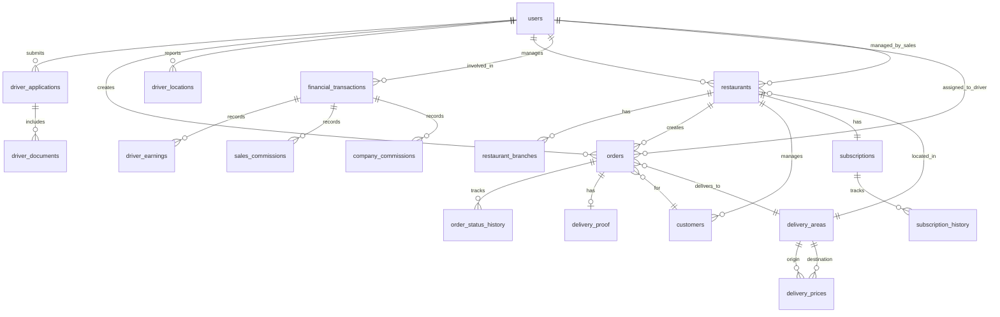
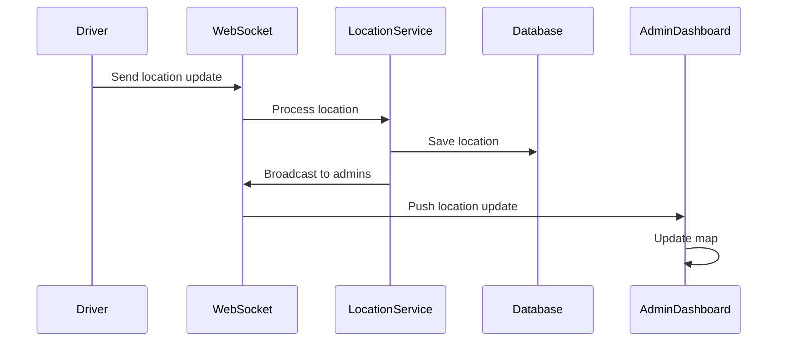
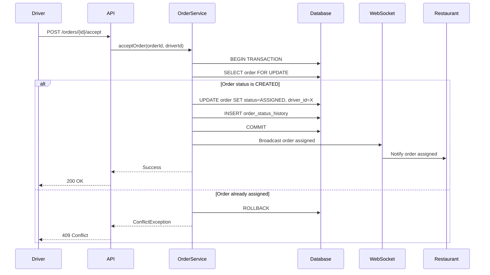

# Design Document: Delivery Platform Backend

## Overview

This document provides the technical design for a production-grade delivery platform backend built with Spring Boot. The system manages deliveries between restaurants, delivery drivers (motorcycle pilots), sales representatives, and system administrators, handling 100,000+ orders per day.

### System Purpose

The delivery platform connects restaurants needing delivery services with motorcycle drivers. Sales representatives onboard restaurants and earn commissions, while admins oversee the entire operation. The system provides real-time order tracking, automated dispatch, financial management, and comprehensive analytics.

### Key Features

- JWT-based authentication with 4 user roles (ADMIN, SALES, RESTAURANT, DRIVER)
- Driver application and approval workflow with document management
- Real-time order dispatch using Haversine formula for distance calculation
- Live driver location tracking with 5-10 second update intervals
- WebSocket-based real-time notifications for order status and location updates
- Geographic delivery areas with configurable pricing matrices
- Financial management: driver earnings, sales commissions, company commissions
- Restaurant subscription management (monthly/yearly/custom periods)
- Multi-branch restaurant support (single branch or brand with multiple branches)
- Comprehensive analytics and reporting dashboards
- Horizontal scalability to support 100k+ orders per day

### Technology Stack

- **Framework**: Spring Boot 3.x
- **Security**: Spring Security with JWT
- **Database**: PostgreSQL 14+
- **ORM**: Spring Data JPA / Hibernate
- **Real-time**: WebSocket (Spring WebSocket + STOMP)
- **Caching**: Redis (optional, for performance optimization)
- **Task Scheduling**: Spring @Scheduled
- **API Documentation**: SpringDoc OpenAPI (Swagger)
- **Database Migration**: Flyway
- **Build Tool**: Maven
- **Java Version**: Java 17+


## Architecture

### High-Level Architecture

The system follows a layered architecture pattern with clear separation of concerns:

```
┌─────────────────────────────────────────────────────────────┐
│                     Client Applications                      │
│         (Mobile Apps, Web Dashboard, Admin Panel)            │
└────────────────────┬────────────────────────────────────────┘
                     │ HTTPS / WebSocket
┌────────────────────▼────────────────────────────────────────┐
│                    API Gateway Layer                         │
│         (Spring Security, JWT Validation, CORS)              │
└────────────────────┬────────────────────────────────────────┘
                     │
┌────────────────────▼────────────────────────────────────────┐
│                   Controller Layer                           │
│    (REST Controllers, WebSocket Controllers, DTOs)           │
└────────────────────┬────────────────────────────────────────┘
                     │
┌────────────────────▼────────────────────────────────────────┐
│                    Service Layer                             │
│  (Business Logic, Validation, Transaction Management)        │
└────────────────────┬────────────────────────────────────────┘
                     │
┌────────────────────▼────────────────────────────────────────┐
│                   Repository Layer                           │
│         (Spring Data JPA Repositories, Queries)              │
└────────────────────┬────────────────────────────────────────┘
                     │
┌────────────────────▼────────────────────────────────────────┐
│                  PostgreSQL Database                         │
│              (Relational Data Storage)                       │
└──────────────────────────────────────────────────────────────┘

         ┌──────────────────────────────────────┐
         │      Supporting Components           │
         ├──────────────────────────────────────┤
         │  Redis Cache (Optional)              │
         │  WebSocket Server                    │
         │  Background Job Scheduler            │
         │  File Storage System                 │
         └──────────────────────────────────────┘
```

### Architectural Patterns

**1. Layered Architecture**
- Controller Layer: HTTP request handling, input validation, DTO mapping
- Service Layer: Business logic, transaction boundaries, orchestration
- Repository Layer: Data access, query optimization
- Domain Layer: Entity models, business rules

**2. Stateless API Design**
- All authentication via JWT tokens
- No server-side session storage
- Enables horizontal scaling across multiple instances

**3. Event-Driven Communication**
- WebSocket channels for real-time updates
- Asynchronous notification processing
- Background job execution for non-critical tasks

**4. Repository Pattern**
- Spring Data JPA repositories for data access
- Custom query methods for complex operations
- Specification pattern for dynamic filtering


### Scalability Design

**Horizontal Scaling**
- Stateless application servers allow multiple instances behind load balancer
- Database connection pooling (HikariCP) for efficient connection management
- Redis for distributed caching and session management
- WebSocket sticky sessions or Redis pub/sub for multi-instance WebSocket support

**Database Optimization**
- Indexed columns on frequently queried fields
- Table partitioning for large tables (orders, location_history)
- Read replicas for analytics and reporting queries
- Connection pooling with appropriate pool size configuration

**Caching Strategy**
- Redis caching for delivery area pricing (rarely changes)
- Restaurant subscription status caching (TTL: 5 minutes)
- User authentication data caching (TTL: token expiry time)
- Cache invalidation on data updates

**Asynchronous Processing**
- Background jobs for subscription checks, financial reports, analytics
- Async notification sending to avoid blocking API requests
- Message queue integration (optional) for high-volume event processing

### Security Architecture

**Authentication Flow**
1. User submits credentials to `/api/v1/auth/login`
2. System validates credentials against database (BCrypt password verification)
3. System generates JWT token with user ID, role, and expiration
4. Client includes JWT in Authorization header for subsequent requests
5. JwtAuthenticationFilter validates token on each request
6. SecurityContext populated with authenticated user details

**Authorization Model**
- Role-based access control (RBAC) with 4 roles: ADMIN, SALES, RESTAURANT, DRIVER
- Method-level security using `@PreAuthorize` annotations
- Resource ownership validation in service layer
- API endpoints protected by role requirements

**Security Measures**
- BCrypt password hashing (strength: 12)
- JWT token expiration (configurable, default: 24 hours)
- HTTPS enforcement in production
- CORS configuration with whitelisted origins
- SQL injection prevention via parameterized queries
- XSS prevention via input sanitization
- Security headers (X-Content-Type-Options, X-Frame-Options, X-XSS-Protection)
- Rate limiting per user role
- File upload validation (type, size, malware scanning)


## Components and Interfaces

### Core Domain Components

**1. User Management Component**
- Entities: User, Role
- Services: AuthenticationService, UserService
- Responsibilities: User authentication, JWT generation, role management
- Key Operations: login, register, refreshToken, changePassword

**2. Driver Application Component**
- Entities: DriverApplication, DriverDocument
- Services: DriverApplicationService, DocumentService
- Responsibilities: Driver onboarding, document verification, approval workflow
- Key Operations: submitApplication, uploadDocument, approveApplication, rejectApplication

**3. Order Management Component**
- Entities: Order, OrderStatusHistory, DeliveryProof
- Services: OrderService, OrderLifecycleService, DispatchService
- Responsibilities: Order creation, status transitions, dispatch logic, delivery tracking
- Key Operations: createOrder, acceptOrder, updateOrderStatus, uploadDeliveryProof

**4. Location Tracking Component**
- Entities: DriverLocation
- Services: LocationService, LocationTrackingService
- Responsibilities: Real-time location updates, location history, distance calculations
- Key Operations: updateLocation, getDriverLocation, calculateDistance

**5. Geographic Management Component**
- Entities: DeliveryArea, DeliveryPrice
- Services: DeliveryAreaService, PricingService
- Responsibilities: Area management, pricing matrix, delivery cost calculation
- Key Operations: createArea, setPrice, calculateDeliveryPrice

**6. Restaurant Management Component**
- Entities: Restaurant, RestaurantBrand, RestaurantBranch, Customer
- Services: RestaurantService, CustomerService
- Responsibilities: Restaurant onboarding, branch management, customer database
- Key Operations: createRestaurant, addBranch, manageCustomers, getStatistics

**7. Subscription Management Component**
- Entities: Subscription, SubscriptionHistory
- Services: SubscriptionService, SubscriptionCheckService
- Responsibilities: Subscription lifecycle, expiration tracking, renewal processing
- Key Operations: createSubscription, renewSubscription, checkExpiration, lockExpiredAccounts

**8. Financial Management Component**
- Entities: FinancialTransaction, DriverEarning, SalesCommission, CompanyCommission
- Services: FinancialService, CommissionService, EarningsService
- Responsibilities: Transaction recording, commission calculation, earnings aggregation
- Key Operations: recordTransaction, calculateCommission, getEarningsReport

**9. Notification Component**
- Entities: Notification, NotificationPreference
- Services: NotificationService, WebSocketService
- Responsibilities: Real-time notifications, WebSocket management, notification preferences
- Key Operations: sendNotification, broadcastUpdate, managePreferences

**10. Analytics Component**
- Entities: AnalyticsSnapshot, PerformanceMetric
- Services: AnalyticsService, ReportingService
- Responsibilities: Data aggregation, performance metrics, report generation
- Key Operations: calculateMetrics, generateReport, exportData


### API Endpoint Design

**Authentication Endpoints**
```
POST   /api/v1/auth/login              - User login (returns JWT)
POST   /api/v1/auth/register           - User registration
POST   /api/v1/auth/refresh            - Refresh JWT token
POST   /api/v1/auth/logout             - Logout (invalidate token)
POST   /api/v1/auth/change-password    - Change password
POST   /api/v1/auth/reset-password     - Request password reset
POST   /api/v1/auth/reset-password/confirm - Confirm password reset
```

**Driver Application Endpoints**
```
POST   /api/v1/driver-applications                    - Submit application (DRIVER)
GET    /api/v1/driver-applications/me                 - Get my application (DRIVER)
POST   /api/v1/driver-applications/{id}/documents     - Upload document (DRIVER)
GET    /api/v1/driver-applications                    - List applications (ADMIN)
GET    /api/v1/driver-applications/{id}               - Get application details (ADMIN)
PUT    /api/v1/driver-applications/{id}/approve       - Approve application (ADMIN)
PUT    /api/v1/driver-applications/{id}/reject        - Reject application (ADMIN)
```

**Order Endpoints**
```
POST   /api/v1/orders                          - Create order (RESTAURANT)
GET    /api/v1/orders                          - List orders (filtered by role)
GET    /api/v1/orders/{id}                     - Get order details
PUT    /api/v1/orders/{id}/accept              - Accept order (DRIVER)
PUT    /api/v1/orders/{id}/status              - Update order status
POST   /api/v1/orders/{id}/delivery-proof      - Upload delivery proof (DRIVER)
PUT    /api/v1/orders/{id}/cancel              - Cancel order (RESTAURANT, ADMIN)
GET    /api/v1/orders/available                - Get available orders (DRIVER)
GET    /api/v1/orders/{id}/history             - Get order status history
POST   /api/v1/orders/{id}/rate                - Rate driver (RESTAURANT)
```

**Driver Location Endpoints**
```
POST   /api/v1/locations                       - Update driver location (DRIVER)
GET    /api/v1/locations/drivers               - Get all driver locations (ADMIN)
GET    /api/v1/locations/drivers/{id}          - Get specific driver location (ADMIN)
GET    /api/v1/locations/drivers/{id}/history  - Get location history (ADMIN)
```

**Driver Endpoints**
```
GET    /api/v1/drivers/me                      - Get my profile (DRIVER)
PUT    /api/v1/drivers/me                      - Update my profile (DRIVER)
PUT    /api/v1/drivers/me/availability         - Set availability status (DRIVER)
GET    /api/v1/drivers/me/earnings             - Get my earnings (DRIVER)
GET    /api/v1/drivers/me/orders               - Get my order history (DRIVER)
GET    /api/v1/drivers/me/statistics           - Get my statistics (DRIVER)
GET    /api/v1/drivers                         - List all drivers (ADMIN)
GET    /api/v1/drivers/{id}                    - Get driver details (ADMIN)
GET    /api/v1/drivers/{id}/performance        - Get driver performance metrics (ADMIN)
PUT    /api/v1/drivers/{id}/suspend            - Suspend driver (ADMIN)
PUT    /api/v1/drivers/{id}/activate           - Activate driver (ADMIN)
```

**Restaurant Endpoints**
```
POST   /api/v1/restaurants                     - Create restaurant (SALES)
GET    /api/v1/restaurants                     - List restaurants (filtered by role)
GET    /api/v1/restaurants/{id}                - Get restaurant details
PUT    /api/v1/restaurants/{id}                - Update restaurant (SALES, ADMIN)
POST   /api/v1/restaurants/{id}/branches       - Add branch (SALES, ADMIN)
GET    /api/v1/restaurants/{id}/branches       - List branches
GET    /api/v1/restaurants/me/statistics       - Get my statistics (RESTAURANT)
GET    /api/v1/restaurants/{id}/performance    - Get performance metrics (SALES, ADMIN)
```

**Customer Endpoints**
```
POST   /api/v1/customers                       - Create customer (RESTAURANT)
GET    /api/v1/customers                       - List my customers (RESTAURANT)
GET    /api/v1/customers/{id}                  - Get customer details (RESTAURANT)
PUT    /api/v1/customers/{id}                  - Update customer (RESTAURANT)
DELETE /api/v1/customers/{id}                  - Delete customer (RESTAURANT)
GET    /api/v1/customers/search                - Search customers (RESTAURANT)
```

**Subscription Endpoints**
```
POST   /api/v1/subscriptions                   - Create subscription (SALES, ADMIN)
GET    /api/v1/subscriptions/{id}              - Get subscription details
PUT    /api/v1/subscriptions/{id}/renew        - Renew subscription (SALES, ADMIN)
GET    /api/v1/subscriptions/expiring          - Get expiring subscriptions (ADMIN)
```


**Delivery Area & Pricing Endpoints**
```
POST   /api/v1/delivery-areas                  - Create delivery area (ADMIN)
GET    /api/v1/delivery-areas                  - List delivery areas
GET    /api/v1/delivery-areas/{id}             - Get area details
PUT    /api/v1/delivery-areas/{id}             - Update area (ADMIN)
DELETE /api/v1/delivery-areas/{id}             - Delete area (ADMIN)
POST   /api/v1/delivery-prices                 - Set delivery price (ADMIN)
GET    /api/v1/delivery-prices                 - List delivery prices
PUT    /api/v1/delivery-prices/{id}            - Update price (ADMIN)
POST   /api/v1/delivery-prices/bulk            - Bulk update prices (ADMIN)
GET    /api/v1/delivery-prices/calculate       - Calculate delivery price
```

**Sales Representative Endpoints**
```
POST   /api/v1/sales                           - Create sales account (ADMIN)
GET    /api/v1/sales                           - List sales reps (ADMIN)
GET    /api/v1/sales/{id}                      - Get sales rep details (ADMIN)
PUT    /api/v1/sales/{id}                      - Update sales rep (ADMIN)
PUT    /api/v1/sales/{id}/deactivate           - Deactivate sales rep (ADMIN)
GET    /api/v1/sales/me/dashboard              - Get my dashboard (SALES)
GET    /api/v1/sales/me/restaurants            - Get my restaurants (SALES)
GET    /api/v1/sales/me/commissions            - Get my commissions (SALES)
PUT    /api/v1/sales/transfer                  - Transfer restaurant (ADMIN)
```

**Financial Endpoints**
```
GET    /api/v1/financials/dashboard            - Get financial dashboard (ADMIN)
GET    /api/v1/financials/transactions         - List transactions (ADMIN)
GET    /api/v1/financials/transactions/{id}    - Get transaction details (ADMIN)
GET    /api/v1/financials/reports              - Generate financial report (ADMIN)
GET    /api/v1/financials/export               - Export financial data (ADMIN)
GET    /api/v1/financials/reconciliation       - Get reconciliation report (ADMIN)
```

**Analytics Endpoints**
```
GET    /api/v1/analytics/overview              - Get platform overview (ADMIN)
GET    /api/v1/analytics/orders                - Get order analytics (ADMIN)
GET    /api/v1/analytics/drivers               - Get driver analytics (ADMIN)
GET    /api/v1/analytics/restaurants           - Get restaurant analytics (ADMIN)
GET    /api/v1/analytics/trends                - Get trend analysis (ADMIN)
GET    /api/v1/analytics/export                - Export analytics data (ADMIN)
```

**Notification Endpoints**
```
GET    /api/v1/notifications                   - List my notifications
GET    /api/v1/notifications/{id}              - Get notification details
PUT    /api/v1/notifications/{id}/read         - Mark as read
PUT    /api/v1/notifications/read-all          - Mark all as read
GET    /api/v1/notifications/preferences       - Get notification preferences
PUT    /api/v1/notifications/preferences       - Update preferences
```

**Configuration Endpoints**
```
GET    /api/v1/config                          - Get all configurations (ADMIN)
GET    /api/v1/config/{key}                    - Get specific config (ADMIN)
PUT    /api/v1/config/{key}                    - Update config (ADMIN)
GET    /api/v1/config/history                  - Get config change history (ADMIN)
```

**System Endpoints**
```
GET    /api/v1/health                          - Health check (public)
GET    /api/v1/health/detailed                 - Detailed health status (ADMIN)
GET    /api/v1/version                         - API version info (public)
POST   /api/v1/announcements                   - Create announcement (ADMIN)
GET    /api/v1/announcements                   - List announcements
POST   /api/v1/disputes                        - Create dispute (RESTAURANT, DRIVER)
GET    /api/v1/disputes                        - List disputes (filtered by role)
PUT    /api/v1/disputes/{id}                   - Update dispute (ADMIN)
```

**WebSocket Endpoints**
```
/ws/connect                                    - WebSocket connection endpoint
/topic/drivers/locations                       - Driver location updates (ADMIN)
/topic/orders/{orderId}/status                 - Order status updates (RESTAURANT)
/topic/drivers/{driverId}/orders               - New order notifications (DRIVER)
/user/queue/notifications                      - Personal notifications
```


## Data Models

### Database Schema Overview

The system uses PostgreSQL with approximately 30 tables organized into logical domains. All tables include audit timestamps (created_at, updated_at) and support soft deletion (deleted_at).

### Entity Relationship Diagram



### Core Tables

**1. users**
```sql
CREATE TABLE users (
    id BIGSERIAL PRIMARY KEY,
    email VARCHAR(255) UNIQUE NOT NULL,
    password_hash VARCHAR(255) NOT NULL,
    full_name VARCHAR(255) NOT NULL,
    phone VARCHAR(50),
    role VARCHAR(20) NOT NULL, -- ADMIN, SALES, RESTAURANT, DRIVER
    status VARCHAR(20) DEFAULT 'ACTIVE', -- ACTIVE, SUSPENDED, LOCKED
    email_verified BOOLEAN DEFAULT FALSE,
    last_login_at TIMESTAMP,
    created_at TIMESTAMP DEFAULT CURRENT_TIMESTAMP,
    updated_at TIMESTAMP DEFAULT CURRENT_TIMESTAMP,
    deleted_at TIMESTAMP,
    CONSTRAINT chk_role CHECK (role IN ('ADMIN', 'SALES', 'RESTAURANT', 'DRIVER')),
    CONSTRAINT chk_status CHECK (status IN ('ACTIVE', 'SUSPENDED', 'LOCKED'))
);

CREATE INDEX idx_users_email ON users(email);
CREATE INDEX idx_users_role ON users(role);
CREATE INDEX idx_users_status ON users(status);
CREATE INDEX idx_users_deleted_at ON users(deleted_at);
```

**2. driver_applications**
```sql
CREATE TABLE driver_applications (
    id BIGSERIAL PRIMARY KEY,
    user_id BIGINT NOT NULL REFERENCES users(id),
    national_id VARCHAR(50) NOT NULL,
    driver_license_number VARCHAR(50) NOT NULL,
    driver_license_expiry DATE NOT NULL,
    motorcycle_license_number VARCHAR(50) NOT NULL,
    motorcycle_license_expiry DATE NOT NULL,
    motorcycle_plate_number VARCHAR(50) NOT NULL,
    address TEXT,
    emergency_contact_name VARCHAR(255),
    emergency_contact_phone VARCHAR(50),
    status VARCHAR(20) DEFAULT 'PENDING', -- PENDING, APPROVED, REJECTED
    reviewed_by BIGINT REFERENCES users(id),
    reviewed_at TIMESTAMP,
    rejection_reason TEXT,
    created_at TIMESTAMP DEFAULT CURRENT_TIMESTAMP,
    updated_at TIMESTAMP DEFAULT CURRENT_TIMESTAMP,
    deleted_at TIMESTAMP,
    CONSTRAINT chk_application_status CHECK (status IN ('PENDING', 'APPROVED', 'REJECTED'))
);

CREATE INDEX idx_driver_applications_user_id ON driver_applications(user_id);
CREATE INDEX idx_driver_applications_status ON driver_applications(status);
CREATE INDEX idx_driver_applications_reviewed_by ON driver_applications(reviewed_by);
```

**3. driver_documents**
```sql
CREATE TABLE driver_documents (
    id BIGSERIAL PRIMARY KEY,
    application_id BIGINT NOT NULL REFERENCES driver_applications(id),
    document_type VARCHAR(50) NOT NULL, -- NATIONAL_ID, DRIVER_LICENSE, MOTORCYCLE_LICENSE, MOTORCYCLE_PHOTO
    file_path VARCHAR(500) NOT NULL,
    file_name VARCHAR(255) NOT NULL,
    file_size BIGINT,
    mime_type VARCHAR(100),
    uploaded_by BIGINT NOT NULL REFERENCES users(id),
    created_at TIMESTAMP DEFAULT CURRENT_TIMESTAMP,
    deleted_at TIMESTAMP,
    CONSTRAINT chk_document_type CHECK (document_type IN ('NATIONAL_ID', 'DRIVER_LICENSE', 'MOTORCYCLE_LICENSE', 'MOTORCYCLE_PHOTO'))
);

CREATE INDEX idx_driver_documents_application_id ON driver_documents(application_id);
CREATE INDEX idx_driver_documents_document_type ON driver_documents(document_type);
```


**4. delivery_areas**
```sql
CREATE TABLE delivery_areas (
    id BIGSERIAL PRIMARY KEY,
    name VARCHAR(255) NOT NULL UNIQUE,
    description TEXT,
    boundaries JSONB, -- GeoJSON polygon for area boundaries
    is_active BOOLEAN DEFAULT TRUE,
    created_at TIMESTAMP DEFAULT CURRENT_TIMESTAMP,
    updated_at TIMESTAMP DEFAULT CURRENT_TIMESTAMP,
    deleted_at TIMESTAMP
);

CREATE INDEX idx_delivery_areas_name ON delivery_areas(name);
CREATE INDEX idx_delivery_areas_is_active ON delivery_areas(is_active);
```

**5. delivery_prices**
```sql
CREATE TABLE delivery_prices (
    id BIGSERIAL PRIMARY KEY,
    origin_area_id BIGINT NOT NULL REFERENCES delivery_areas(id),
    destination_area_id BIGINT NOT NULL REFERENCES delivery_areas(id),
    price DECIMAL(10, 2) NOT NULL,
    currency VARCHAR(3) DEFAULT 'USD',
    is_active BOOLEAN DEFAULT TRUE,
    created_at TIMESTAMP DEFAULT CURRENT_TIMESTAMP,
    updated_at TIMESTAMP DEFAULT CURRENT_TIMESTAMP,
    deleted_at TIMESTAMP,
    CONSTRAINT chk_price_positive CHECK (price >= 0),
    CONSTRAINT uq_area_pair UNIQUE (origin_area_id, destination_area_id)
);

CREATE INDEX idx_delivery_prices_origin ON delivery_prices(origin_area_id);
CREATE INDEX idx_delivery_prices_destination ON delivery_prices(destination_area_id);
CREATE INDEX idx_delivery_prices_is_active ON delivery_prices(is_active);
```

**6. restaurants**
```sql
CREATE TABLE restaurants (
    id BIGSERIAL PRIMARY KEY,
    user_id BIGINT NOT NULL REFERENCES users(id),
    business_name VARCHAR(255) NOT NULL,
    contact_name VARCHAR(255),
    contact_phone VARCHAR(50),
    contact_email VARCHAR(255),
    address TEXT,
    delivery_area_id BIGINT REFERENCES delivery_areas(id),
    restaurant_type VARCHAR(20) DEFAULT 'SINGLE_BRANCH', -- SINGLE_BRANCH, BRAND
    parent_brand_id BIGINT REFERENCES restaurants(id), -- NULL for brands and single branches
    sales_rep_id BIGINT REFERENCES users(id),
    status VARCHAR(20) DEFAULT 'ACTIVE', -- ACTIVE, LOCKED, SUSPENDED
    created_at TIMESTAMP DEFAULT CURRENT_TIMESTAMP,
    updated_at TIMESTAMP DEFAULT CURRENT_TIMESTAMP,
    deleted_at TIMESTAMP,
    CONSTRAINT chk_restaurant_type CHECK (restaurant_type IN ('SINGLE_BRANCH', 'BRAND')),
    CONSTRAINT chk_restaurant_status CHECK (status IN ('ACTIVE', 'LOCKED', 'SUSPENDED'))
);

CREATE INDEX idx_restaurants_user_id ON restaurants(user_id);
CREATE INDEX idx_restaurants_sales_rep_id ON restaurants(sales_rep_id);
CREATE INDEX idx_restaurants_parent_brand_id ON restaurants(parent_brand_id);
CREATE INDEX idx_restaurants_status ON restaurants(status);
CREATE INDEX idx_restaurants_delivery_area_id ON restaurants(delivery_area_id);
```

**7. restaurant_branches**
```sql
CREATE TABLE restaurant_branches (
    id BIGSERIAL PRIMARY KEY,
    brand_id BIGINT NOT NULL REFERENCES restaurants(id),
    branch_name VARCHAR(255) NOT NULL,
    address TEXT NOT NULL,
    delivery_area_id BIGINT NOT NULL REFERENCES delivery_areas(id),
    contact_phone VARCHAR(50),
    latitude DECIMAL(10, 8),
    longitude DECIMAL(11, 8),
    is_active BOOLEAN DEFAULT TRUE,
    created_at TIMESTAMP DEFAULT CURRENT_TIMESTAMP,
    updated_at TIMESTAMP DEFAULT CURRENT_TIMESTAMP,
    deleted_at TIMESTAMP
);

CREATE INDEX idx_restaurant_branches_brand_id ON restaurant_branches(brand_id);
CREATE INDEX idx_restaurant_branches_delivery_area_id ON restaurant_branches(delivery_area_id);
CREATE INDEX idx_restaurant_branches_is_active ON restaurant_branches(is_active);
```

**8. subscriptions**
```sql
CREATE TABLE subscriptions (
    id BIGSERIAL PRIMARY KEY,
    restaurant_id BIGINT NOT NULL REFERENCES restaurants(id),
    subscription_type VARCHAR(20) NOT NULL, -- MONTHLY, YEARLY, CUSTOM
    custom_months INTEGER, -- Used when type is CUSTOM
    start_date DATE NOT NULL,
    end_date DATE NOT NULL,
    amount DECIMAL(10, 2) NOT NULL,
    currency VARCHAR(3) DEFAULT 'USD',
    status VARCHAR(20) DEFAULT 'ACTIVE', -- ACTIVE, EXPIRED, CANCELLED
    auto_renew BOOLEAN DEFAULT FALSE,
    created_at TIMESTAMP DEFAULT CURRENT_TIMESTAMP,
    updated_at TIMESTAMP DEFAULT CURRENT_TIMESTAMP,
    deleted_at TIMESTAMP,
    CONSTRAINT chk_subscription_type CHECK (subscription_type IN ('MONTHLY', 'YEARLY', 'CUSTOM')),
    CONSTRAINT chk_subscription_status CHECK (status IN ('ACTIVE', 'EXPIRED', 'CANCELLED')),
    CONSTRAINT chk_amount_positive CHECK (amount >= 0)
);

CREATE INDEX idx_subscriptions_restaurant_id ON subscriptions(restaurant_id);
CREATE INDEX idx_subscriptions_end_date ON subscriptions(end_date);
CREATE INDEX idx_subscriptions_status ON subscriptions(status);
```

**9. subscription_history**
```sql
CREATE TABLE subscription_history (
    id BIGSERIAL PRIMARY KEY,
    subscription_id BIGINT NOT NULL REFERENCES subscriptions(id),
    action VARCHAR(50) NOT NULL, -- CREATED, RENEWED, EXPIRED, CANCELLED
    previous_end_date DATE,
    new_end_date DATE,
    amount DECIMAL(10, 2),
    performed_by BIGINT REFERENCES users(id),
    notes TEXT,
    created_at TIMESTAMP DEFAULT CURRENT_TIMESTAMP
);

CREATE INDEX idx_subscription_history_subscription_id ON subscription_history(subscription_id);
CREATE INDEX idx_subscription_history_action ON subscription_history(action);
```


**10. customers**
```sql
CREATE TABLE customers (
    id BIGSERIAL PRIMARY KEY,
    restaurant_id BIGINT NOT NULL REFERENCES restaurants(id),
    name VARCHAR(255) NOT NULL,
    phone VARCHAR(50) NOT NULL,
    address TEXT NOT NULL,
    latitude DECIMAL(10, 8),
    longitude DECIMAL(11, 8),
    notes TEXT,
    order_count INTEGER DEFAULT 0,
    created_at TIMESTAMP DEFAULT CURRENT_TIMESTAMP,
    updated_at TIMESTAMP DEFAULT CURRENT_TIMESTAMP,
    deleted_at TIMESTAMP
);

CREATE INDEX idx_customers_restaurant_id ON customers(restaurant_id);
CREATE INDEX idx_customers_phone ON customers(phone);
CREATE INDEX idx_customers_name ON customers(name);
```

**11. orders**
```sql
CREATE TABLE orders (
    id BIGSERIAL PRIMARY KEY,
    order_number VARCHAR(50) UNIQUE NOT NULL,
    restaurant_id BIGINT NOT NULL REFERENCES restaurants(id),
    branch_id BIGINT REFERENCES restaurant_branches(id),
    customer_id BIGINT NOT NULL REFERENCES customers(id),
    driver_id BIGINT REFERENCES users(id),
    pickup_address TEXT NOT NULL,
    pickup_latitude DECIMAL(10, 8),
    pickup_longitude DECIMAL(11, 8),
    delivery_address TEXT NOT NULL,
    delivery_latitude DECIMAL(10, 8),
    delivery_longitude DECIMAL(11, 8),
    delivery_area_id BIGINT NOT NULL REFERENCES delivery_areas(id),
    order_total DECIMAL(10, 2) NOT NULL,
    delivery_price DECIMAL(10, 2) NOT NULL,
    customer_reference VARCHAR(255),
    notes TEXT,
    image_path VARCHAR(500),
    status VARCHAR(30) DEFAULT 'CREATED', -- CREATED, ASSIGNED, PICKED_FROM_RESTAURANT, DELIVERED, CUSTOMER_NOT_AVAILABLE, CANCELLED
    assigned_at TIMESTAMP,
    picked_at TIMESTAMP,
    delivered_at TIMESTAMP,
    completion_latitude DECIMAL(10, 8),
    completion_longitude DECIMAL(11, 8),
    cancellation_reason TEXT,
    cancelled_by BIGINT REFERENCES users(id),
    estimated_delivery_time INTEGER, -- in minutes
    actual_delivery_time INTEGER, -- in minutes
    driver_rating INTEGER,
    driver_rating_comment TEXT,
    idempotency_key VARCHAR(255) UNIQUE,
    created_at TIMESTAMP DEFAULT CURRENT_TIMESTAMP,
    updated_at TIMESTAMP DEFAULT CURRENT_TIMESTAMP,
    deleted_at TIMESTAMP,
    CONSTRAINT chk_order_status CHECK (status IN ('CREATED', 'ASSIGNED', 'PICKED_FROM_RESTAURANT', 'DELIVERED', 'CUSTOMER_NOT_AVAILABLE', 'CANCELLED')),
    CONSTRAINT chk_driver_rating CHECK (driver_rating IS NULL OR (driver_rating >= 1 AND driver_rating <= 5)),
    CONSTRAINT chk_order_total_positive CHECK (order_total >= 0),
    CONSTRAINT chk_delivery_price_positive CHECK (delivery_price >= 0)
);

CREATE INDEX idx_orders_restaurant_id ON orders(restaurant_id);
CREATE INDEX idx_orders_driver_id ON orders(driver_id);
CREATE INDEX idx_orders_customer_id ON orders(customer_id);
CREATE INDEX idx_orders_status ON orders(status);
CREATE INDEX idx_orders_created_at ON orders(created_at);
CREATE INDEX idx_orders_order_number ON orders(order_number);
CREATE INDEX idx_orders_idempotency_key ON orders(idempotency_key);

-- Partition by month for scalability
-- ALTER TABLE orders PARTITION BY RANGE (created_at);
```

**12. order_status_history**
```sql
CREATE TABLE order_status_history (
    id BIGSERIAL PRIMARY KEY,
    order_id BIGINT NOT NULL REFERENCES orders(id),
    previous_status VARCHAR(30),
    new_status VARCHAR(30) NOT NULL,
    changed_by BIGINT REFERENCES users(id),
    latitude DECIMAL(10, 8),
    longitude DECIMAL(11, 8),
    notes TEXT,
    created_at TIMESTAMP DEFAULT CURRENT_TIMESTAMP
);

CREATE INDEX idx_order_status_history_order_id ON order_status_history(order_id);
CREATE INDEX idx_order_status_history_created_at ON order_status_history(created_at);
```

**13. delivery_proof**
```sql
CREATE TABLE delivery_proof (
    id BIGSERIAL PRIMARY KEY,
    order_id BIGINT NOT NULL REFERENCES orders(id),
    file_path VARCHAR(500) NOT NULL,
    file_name VARCHAR(255) NOT NULL,
    file_size BIGINT,
    mime_type VARCHAR(100),
    latitude DECIMAL(10, 8),
    longitude DECIMAL(11, 8),
    uploaded_by BIGINT NOT NULL REFERENCES users(id),
    created_at TIMESTAMP DEFAULT CURRENT_TIMESTAMP,
    deleted_at TIMESTAMP
);

CREATE INDEX idx_delivery_proof_order_id ON delivery_proof(order_id);
CREATE INDEX idx_delivery_proof_uploaded_by ON delivery_proof(uploaded_by);
```

**14. driver_locations**
```sql
CREATE TABLE driver_locations (
    id BIGSERIAL PRIMARY KEY,
    driver_id BIGINT NOT NULL REFERENCES users(id),
    latitude DECIMAL(10, 8) NOT NULL,
    longitude DECIMAL(11, 8) NOT NULL,
    accuracy DECIMAL(10, 2), -- GPS accuracy in meters
    speed DECIMAL(10, 2), -- Speed in km/h
    heading DECIMAL(5, 2), -- Direction in degrees
    created_at TIMESTAMP DEFAULT CURRENT_TIMESTAMP,
    CONSTRAINT chk_latitude CHECK (latitude >= -90 AND latitude <= 90),
    CONSTRAINT chk_longitude CHECK (longitude >= -180 AND longitude <= 180)
);

CREATE INDEX idx_driver_locations_driver_id ON driver_locations(driver_id);
CREATE INDEX idx_driver_locations_created_at ON driver_locations(created_at);
CREATE INDEX idx_driver_locations_driver_time ON driver_locations(driver_id, created_at DESC);

-- Partition by month for scalability
-- ALTER TABLE driver_locations PARTITION BY RANGE (created_at);
```


**15. driver_availability**
```sql
CREATE TABLE driver_availability (
    id BIGSERIAL PRIMARY KEY,
    driver_id BIGINT NOT NULL REFERENCES users(id),
    status VARCHAR(20) NOT NULL, -- AVAILABLE, UNAVAILABLE
    changed_at TIMESTAMP DEFAULT CURRENT_TIMESTAMP,
    CONSTRAINT chk_availability_status CHECK (status IN ('AVAILABLE', 'UNAVAILABLE'))
);

CREATE INDEX idx_driver_availability_driver_id ON driver_availability(driver_id);
CREATE INDEX idx_driver_availability_status ON driver_availability(status);
CREATE INDEX idx_driver_availability_changed_at ON driver_availability(changed_at);
```

**16. financial_transactions**
```sql
CREATE TABLE financial_transactions (
    id BIGSERIAL PRIMARY KEY,
    transaction_type VARCHAR(50) NOT NULL, -- DRIVER_EARNING, SALES_COMMISSION, COMPANY_COMMISSION, SUBSCRIPTION_PAYMENT
    amount DECIMAL(10, 2) NOT NULL,
    currency VARCHAR(3) DEFAULT 'USD',
    order_id BIGINT REFERENCES orders(id),
    subscription_id BIGINT REFERENCES subscriptions(id),
    user_id BIGINT REFERENCES users(id), -- Driver or Sales rep
    restaurant_id BIGINT REFERENCES restaurants(id),
    description TEXT,
    reference_number VARCHAR(100) UNIQUE,
    status VARCHAR(20) DEFAULT 'COMPLETED', -- PENDING, COMPLETED, FAILED, REVERSED
    created_at TIMESTAMP DEFAULT CURRENT_TIMESTAMP,
    CONSTRAINT chk_transaction_type CHECK (transaction_type IN ('DRIVER_EARNING', 'SALES_COMMISSION', 'COMPANY_COMMISSION', 'SUBSCRIPTION_PAYMENT')),
    CONSTRAINT chk_transaction_status CHECK (status IN ('PENDING', 'COMPLETED', 'FAILED', 'REVERSED'))
);

CREATE INDEX idx_financial_transactions_type ON financial_transactions(transaction_type);
CREATE INDEX idx_financial_transactions_order_id ON financial_transactions(order_id);
CREATE INDEX idx_financial_transactions_user_id ON financial_transactions(user_id);
CREATE INDEX idx_financial_transactions_restaurant_id ON financial_transactions(restaurant_id);
CREATE INDEX idx_financial_transactions_created_at ON financial_transactions(created_at);
CREATE INDEX idx_financial_transactions_reference ON financial_transactions(reference_number);
```

**17. driver_earnings**
```sql
CREATE TABLE driver_earnings (
    id BIGSERIAL PRIMARY KEY,
    driver_id BIGINT NOT NULL REFERENCES users(id),
    order_id BIGINT NOT NULL REFERENCES orders(id),
    transaction_id BIGINT NOT NULL REFERENCES financial_transactions(id),
    delivery_price DECIMAL(10, 2) NOT NULL,
    company_commission DECIMAL(10, 2) NOT NULL,
    driver_earning DECIMAL(10, 2) NOT NULL,
    created_at TIMESTAMP DEFAULT CURRENT_TIMESTAMP
);

CREATE INDEX idx_driver_earnings_driver_id ON driver_earnings(driver_id);
CREATE INDEX idx_driver_earnings_order_id ON driver_earnings(order_id);
CREATE INDEX idx_driver_earnings_created_at ON driver_earnings(created_at);
```

**18. sales_commissions**
```sql
CREATE TABLE sales_commissions (
    id BIGSERIAL PRIMARY KEY,
    sales_rep_id BIGINT NOT NULL REFERENCES users(id),
    restaurant_id BIGINT NOT NULL REFERENCES restaurants(id),
    subscription_id BIGINT NOT NULL REFERENCES subscriptions(id),
    transaction_id BIGINT NOT NULL REFERENCES financial_transactions(id),
    subscription_amount DECIMAL(10, 2) NOT NULL,
    commission_percentage DECIMAL(5, 2) NOT NULL,
    commission_amount DECIMAL(10, 2) NOT NULL,
    commission_type VARCHAR(20) NOT NULL, -- NEW_RESTAURANT, RENEWAL
    created_at TIMESTAMP DEFAULT CURRENT_TIMESTAMP,
    CONSTRAINT chk_commission_type CHECK (commission_type IN ('NEW_RESTAURANT', 'RENEWAL'))
);

CREATE INDEX idx_sales_commissions_sales_rep_id ON sales_commissions(sales_rep_id);
CREATE INDEX idx_sales_commissions_restaurant_id ON sales_commissions(restaurant_id);
CREATE INDEX idx_sales_commissions_created_at ON sales_commissions(created_at);
```

**19. company_commissions**
```sql
CREATE TABLE company_commissions (
    id BIGSERIAL PRIMARY KEY,
    order_id BIGINT NOT NULL REFERENCES orders(id),
    transaction_id BIGINT NOT NULL REFERENCES financial_transactions(id),
    delivery_price DECIMAL(10, 2) NOT NULL,
    commission_type VARCHAR(20) NOT NULL, -- FIXED_PER_ORDER, PERCENTAGE
    commission_value DECIMAL(10, 2) NOT NULL, -- Fixed amount or percentage
    commission_amount DECIMAL(10, 2) NOT NULL,
    created_at TIMESTAMP DEFAULT CURRENT_TIMESTAMP,
    CONSTRAINT chk_company_commission_type CHECK (commission_type IN ('FIXED_PER_ORDER', 'PERCENTAGE'))
);

CREATE INDEX idx_company_commissions_order_id ON company_commissions(order_id);
CREATE INDEX idx_company_commissions_created_at ON company_commissions(created_at);
```

**20. notifications**
```sql
CREATE TABLE notifications (
    id BIGSERIAL PRIMARY KEY,
    user_id BIGINT NOT NULL REFERENCES users(id),
    notification_type VARCHAR(50) NOT NULL, -- ORDER_STATUS, SUBSCRIPTION_EXPIRY, DOCUMENT_EXPIRY, EARNINGS_SUMMARY, SYSTEM_ANNOUNCEMENT
    title VARCHAR(255) NOT NULL,
    message TEXT NOT NULL,
    related_entity_type VARCHAR(50), -- ORDER, SUBSCRIPTION, DRIVER_APPLICATION, etc.
    related_entity_id BIGINT,
    is_read BOOLEAN DEFAULT FALSE,
    read_at TIMESTAMP,
    priority VARCHAR(20) DEFAULT 'NORMAL', -- LOW, NORMAL, HIGH, URGENT
    created_at TIMESTAMP DEFAULT CURRENT_TIMESTAMP,
    CONSTRAINT chk_notification_type CHECK (notification_type IN ('ORDER_STATUS', 'SUBSCRIPTION_EXPIRY', 'DOCUMENT_EXPIRY', 'EARNINGS_SUMMARY', 'SYSTEM_ANNOUNCEMENT')),
    CONSTRAINT chk_priority CHECK (priority IN ('LOW', 'NORMAL', 'HIGH', 'URGENT'))
);

CREATE INDEX idx_notifications_user_id ON notifications(user_id);
CREATE INDEX idx_notifications_is_read ON notifications(is_read);
CREATE INDEX idx_notifications_created_at ON notifications(created_at);
CREATE INDEX idx_notifications_type ON notifications(notification_type);
```


**21. notification_preferences**
```sql
CREATE TABLE notification_preferences (
    id BIGSERIAL PRIMARY KEY,
    user_id BIGINT NOT NULL REFERENCES users(id),
    notification_type VARCHAR(50) NOT NULL,
    enabled BOOLEAN DEFAULT TRUE,
    websocket_enabled BOOLEAN DEFAULT TRUE,
    created_at TIMESTAMP DEFAULT CURRENT_TIMESTAMP,
    updated_at TIMESTAMP DEFAULT CURRENT_TIMESTAMP,
    CONSTRAINT uq_user_notification_type UNIQUE (user_id, notification_type)
);

CREATE INDEX idx_notification_preferences_user_id ON notification_preferences(user_id);
```

**22. system_announcements**
```sql
CREATE TABLE system_announcements (
    id BIGSERIAL PRIMARY KEY,
    title VARCHAR(255) NOT NULL,
    message TEXT NOT NULL,
    target_role VARCHAR(20), -- NULL means all users, or specific role
    is_urgent BOOLEAN DEFAULT FALSE,
    publish_at TIMESTAMP DEFAULT CURRENT_TIMESTAMP,
    expire_at TIMESTAMP,
    created_by BIGINT NOT NULL REFERENCES users(id),
    created_at TIMESTAMP DEFAULT CURRENT_TIMESTAMP,
    updated_at TIMESTAMP DEFAULT CURRENT_TIMESTAMP,
    deleted_at TIMESTAMP
);

CREATE INDEX idx_system_announcements_target_role ON system_announcements(target_role);
CREATE INDEX idx_system_announcements_publish_at ON system_announcements(publish_at);
CREATE INDEX idx_system_announcements_expire_at ON system_announcements(expire_at);
```

**23. announcement_views**
```sql
CREATE TABLE announcement_views (
    id BIGSERIAL PRIMARY KEY,
    announcement_id BIGINT NOT NULL REFERENCES system_announcements(id),
    user_id BIGINT NOT NULL REFERENCES users(id),
    viewed_at TIMESTAMP DEFAULT CURRENT_TIMESTAMP,
    CONSTRAINT uq_announcement_user UNIQUE (announcement_id, user_id)
);

CREATE INDEX idx_announcement_views_announcement_id ON announcement_views(announcement_id);
CREATE INDEX idx_announcement_views_user_id ON announcement_views(user_id);
```

**24. disputes**
```sql
CREATE TABLE disputes (
    id BIGSERIAL PRIMARY KEY,
    order_id BIGINT NOT NULL REFERENCES orders(id),
    reported_by BIGINT NOT NULL REFERENCES users(id),
    dispute_type VARCHAR(50) NOT NULL, -- PAYMENT_ISSUE, DELIVERY_ISSUE, CUSTOMER_ISSUE, OTHER
    description TEXT NOT NULL,
    status VARCHAR(20) DEFAULT 'OPEN', -- OPEN, UNDER_REVIEW, RESOLVED, CLOSED
    assigned_to BIGINT REFERENCES users(id),
    resolution TEXT,
    resolved_at TIMESTAMP,
    created_at TIMESTAMP DEFAULT CURRENT_TIMESTAMP,
    updated_at TIMESTAMP DEFAULT CURRENT_TIMESTAMP,
    CONSTRAINT chk_dispute_type CHECK (dispute_type IN ('PAYMENT_ISSUE', 'DELIVERY_ISSUE', 'CUSTOMER_ISSUE', 'OTHER')),
    CONSTRAINT chk_dispute_status CHECK (status IN ('OPEN', 'UNDER_REVIEW', 'RESOLVED', 'CLOSED'))
);

CREATE INDEX idx_disputes_order_id ON disputes(order_id);
CREATE INDEX idx_disputes_reported_by ON disputes(reported_by);
CREATE INDEX idx_disputes_status ON disputes(status);
CREATE INDEX idx_disputes_assigned_to ON disputes(assigned_to);
```

**25. dispute_attachments**
```sql
CREATE TABLE dispute_attachments (
    id BIGSERIAL PRIMARY KEY,
    dispute_id BIGINT NOT NULL REFERENCES disputes(id),
    file_path VARCHAR(500) NOT NULL,
    file_name VARCHAR(255) NOT NULL,
    file_size BIGINT,
    mime_type VARCHAR(100),
    uploaded_by BIGINT NOT NULL REFERENCES users(id),
    created_at TIMESTAMP DEFAULT CURRENT_TIMESTAMP
);

CREATE INDEX idx_dispute_attachments_dispute_id ON dispute_attachments(dispute_id);
```

**26. system_configurations**
```sql
CREATE TABLE system_configurations (
    id BIGSERIAL PRIMARY KEY,
    config_key VARCHAR(100) UNIQUE NOT NULL,
    config_value TEXT NOT NULL,
    value_type VARCHAR(20) NOT NULL, -- STRING, INTEGER, DECIMAL, BOOLEAN, JSON
    description TEXT,
    is_editable BOOLEAN DEFAULT TRUE,
    created_at TIMESTAMP DEFAULT CURRENT_TIMESTAMP,
    updated_at TIMESTAMP DEFAULT CURRENT_TIMESTAMP,
    CONSTRAINT chk_value_type CHECK (value_type IN ('STRING', 'INTEGER', 'DECIMAL', 'BOOLEAN', 'JSON'))
);

CREATE INDEX idx_system_configurations_key ON system_configurations(config_key);
```

**27. configuration_history**
```sql
CREATE TABLE configuration_history (
    id BIGSERIAL PRIMARY KEY,
    config_id BIGINT NOT NULL REFERENCES system_configurations(id),
    previous_value TEXT,
    new_value TEXT NOT NULL,
    changed_by BIGINT NOT NULL REFERENCES users(id),
    created_at TIMESTAMP DEFAULT CURRENT_TIMESTAMP
);

CREATE INDEX idx_configuration_history_config_id ON configuration_history(config_id);
CREATE INDEX idx_configuration_history_changed_by ON configuration_history(changed_by);
```

**28. analytics_snapshots**
```sql
CREATE TABLE analytics_snapshots (
    id BIGSERIAL PRIMARY KEY,
    snapshot_date DATE NOT NULL,
    metric_type VARCHAR(50) NOT NULL, -- DAILY_ORDERS, ACTIVE_DRIVERS, ACTIVE_RESTAURANTS, REVENUE, etc.
    metric_value DECIMAL(15, 2) NOT NULL,
    metadata JSONB, -- Additional context data
    created_at TIMESTAMP DEFAULT CURRENT_TIMESTAMP,
    CONSTRAINT uq_snapshot_date_type UNIQUE (snapshot_date, metric_type)
);

CREATE INDEX idx_analytics_snapshots_date ON analytics_snapshots(snapshot_date);
CREATE INDEX idx_analytics_snapshots_type ON analytics_snapshots(metric_type);
```

**29. password_reset_tokens**
```sql
CREATE TABLE password_reset_tokens (
    id BIGSERIAL PRIMARY KEY,
    user_id BIGINT NOT NULL REFERENCES users(id),
    token VARCHAR(255) UNIQUE NOT NULL,
    expires_at TIMESTAMP NOT NULL,
    used_at TIMESTAMP,
    created_at TIMESTAMP DEFAULT CURRENT_TIMESTAMP
);

CREATE INDEX idx_password_reset_tokens_token ON password_reset_tokens(token);
CREATE INDEX idx_password_reset_tokens_user_id ON password_reset_tokens(user_id);
CREATE INDEX idx_password_reset_tokens_expires_at ON password_reset_tokens(expires_at);
```

**30. audit_logs**
```sql
CREATE TABLE audit_logs (
    id BIGSERIAL PRIMARY KEY,
    user_id BIGINT REFERENCES users(id),
    action VARCHAR(100) NOT NULL,
    entity_type VARCHAR(50) NOT NULL,
    entity_id BIGINT,
    old_values JSONB,
    new_values JSONB,
    ip_address VARCHAR(45),
    user_agent TEXT,
    created_at TIMESTAMP DEFAULT CURRENT_TIMESTAMP
);

CREATE INDEX idx_audit_logs_user_id ON audit_logs(user_id);
CREATE INDEX idx_audit_logs_entity_type ON audit_logs(entity_type);
CREATE INDEX idx_audit_logs_entity_id ON audit_logs(entity_id);
CREATE INDEX idx_audit_logs_created_at ON audit_logs(created_at);
```


### Key Data Model Decisions

**1. Soft Delete Strategy**
All primary tables include a `deleted_at` timestamp column. Default queries exclude soft-deleted records using `WHERE deleted_at IS NULL`. This allows data recovery and maintains referential integrity.

**2. Audit Timestamps**
Every table includes `created_at` and `updated_at` timestamps. These are automatically managed by JPA annotations (`@CreatedDate`, `@LastModifiedDate`) with `@EntityListeners(AuditingEntityListener.class)`.

**3. Table Partitioning**
Large tables (`orders`, `driver_locations`) should be partitioned by date ranges (monthly) to maintain query performance as data grows. This is implemented at the database level.

**4. Indexing Strategy**
- Primary keys: Clustered indexes (automatic)
- Foreign keys: Non-clustered indexes for join performance
- Status columns: Indexes for filtering
- Timestamp columns: Indexes for date range queries
- Composite indexes for common query patterns (e.g., driver_id + created_at)

**5. Decimal Precision**
Financial amounts use `DECIMAL(10, 2)` for precise currency calculations. GPS coordinates use `DECIMAL(10, 8)` for latitude and `DECIMAL(11, 8)` for longitude to provide ~1cm accuracy.

**6. Constraint Enforcement**
- CHECK constraints for enum-like values
- UNIQUE constraints for business keys (email, order_number)
- Foreign key constraints for referential integrity
- NOT NULL constraints for required fields

**7. JSONB Usage**
JSONB columns store flexible data structures:
- `delivery_areas.boundaries`: GeoJSON polygons
- `analytics_snapshots.metadata`: Additional metric context
- `audit_logs.old_values/new_values`: Change tracking


## Correctness Properties

*A property is a characteristic or behavior that should hold true across all valid executions of a system—essentially, a formal statement about what the system should do. Properties serve as the bridge between human-readable specifications and machine-verifiable correctness guarantees.*

### Property 1: Authentication Token Generation

*For any* valid user credentials, when authentication succeeds, the system should return a valid JWT token containing the user's ID, role, and expiration time.

**Validates: Requirements 1.2, 1.3**

### Property 2: Authorization Enforcement

*For any* authenticated user and any protected endpoint requiring a role not possessed by that user, the system should deny access with HTTP 403 status.

**Validates: Requirements 1.4, 1.5**

### Property 3: Haversine Distance Calculation Accuracy

*For any* two valid GPS coordinate pairs, the calculated distance using the Haversine formula should be within 1% of the actual great-circle distance.

**Validates: Requirements 3.1, 36.6**

### Property 4: Available Orders Filtering

*For any* driver location and configured radius, all returned available orders should have status CREATED, be within the specified radius, and not be assigned to any driver.

**Validates: Requirements 3.2, 3.5**

### Property 5: Order Status Transition Validity

*For any* order, status transitions should only occur along valid paths in the order lifecycle state machine (CREATED → ASSIGNED → PICKED_FROM_RESTAURANT → {DELIVERED, CUSTOMER_NOT_AVAILABLE, CANCELLED}).

**Validates: Requirements 4.1, 5.2, 5.3, 5.4, 5.7**

### Property 6: Concurrent Order Acceptance Exclusivity

*For any* order in CREATED status, when multiple drivers attempt to accept it concurrently, exactly one driver should succeed and the order should be assigned to only that driver.

**Validates: Requirements 4.4, 4.5, 63.2, 63.6**

### Property 7: Delivery Proof Requirement

*For any* order being transitioned to DELIVERED status, a delivery proof photo must be provided, and the transition should fail if no photo is uploaded.

**Validates: Requirements 6.1**

### Property 8: Delivery Price Calculation

*For any* restaurant and delivery area combination where a price is defined, the calculated delivery price should exactly match the configured price for that area pair.

**Validates: Requirements 7.3, 8.3**

### Property 9: Missing Price Error Handling

*For any* restaurant and delivery area combination where no price is defined, attempting to calculate delivery price should return an error.

**Validates: Requirements 8.4**

### Property 10: Expired Subscription Order Prevention

*For any* restaurant with an expired subscription (end_date < current_date) or LOCKED status, order creation attempts should fail with an appropriate error message.

**Validates: Requirements 7.6, 16.3, 16.4**

### Property 11: Driver Earnings Calculation

*For any* completed order, driver earnings should equal the delivery price minus the company commission, where commission is calculated correctly based on commission type (FIXED_PER_ORDER or PERCENTAGE).

**Validates: Requirements 11.2, 11.3, 11.4**

### Property 12: Sales Commission Calculation

*For any* subscription payment, the sales commission should be calculated using NEW_RESTAURANT_COMMISSION percentage for first subscriptions and OLD_RESTAURANT_COMMISSION percentage for renewals.

**Validates: Requirements 20.1, 20.2**

### Property 13: Order Status History Recording

*For any* order status change, a corresponding Order_Status_History record should be created with the previous status, new status, timestamp, and user who made the change.

**Validates: Requirements 28.1**

### Property 14: Soft Delete Behavior

*For any* entity that is soft deleted, the deleted_at timestamp should be set, the record should remain in the database, and it should not appear in default queries unless explicitly requested.

**Validates: Requirements 27.4, 43.2, 43.3**

### Property 15: Input Validation - Required Fields

*For any* API request, if required fields are missing, the system should reject the request with HTTP 400 status and detailed validation error messages.

**Validates: Requirements 33.1**

### Property 16: Input Validation - GPS Coordinates

*For any* GPS coordinate input, latitude values outside [-90, 90] or longitude values outside [-180, 180] should be rejected with a validation error.

**Validates: Requirements 33.5**

### Property 17: Input Validation - Positive Prices

*For any* price input (delivery price, subscription amount, etc.), negative or zero values should be rejected with a validation error.

**Validates: Requirements 33.6**

### Property 18: Transaction Atomicity

*For any* operation that modifies multiple entities, if any validation fails, no changes should be persisted to the database (all-or-nothing behavior).

**Validates: Requirements 37.6, 52.4**

### Property 19: Password Security

*For any* password stored in the database or appearing in logs/API responses, it should never be in plain text - stored passwords should be BCrypt hashes.

**Validates: Requirements 42.1, 42.4**

### Property 20: Idempotency Guarantee

*For any* idempotent operation (order creation, payment processing), repeating the request with the same idempotency key should return the original response without creating duplicate records or side effects.

**Validates: Requirements 47.2**

### Property 21: Order Assignment Timeout

*For any* order in ASSIGNED status that exceeds the configured timeout period without status progression, the system should automatically change its status back to CREATED and clear the driver assignment.

**Validates: Requirements 51.1**

### Property 22: Financial Transaction Immutability

*For any* financial transaction record, attempts to modify or delete it should fail, ensuring the financial audit trail cannot be altered.

**Validates: Requirements 53.6**


## Error Handling

### Error Response Format

All API errors return a consistent JSON structure:

```json
{
  "timestamp": "2024-01-15T10:30:00Z",
  "status": 400,
  "error": "Bad Request",
  "errorCode": "VALIDATION_ERROR",
  "message": "Validation failed for request",
  "details": [
    {
      "field": "email",
      "message": "Email format is invalid"
    }
  ],
  "path": "/api/v1/users",
  "correlationId": "a1b2c3d4-e5f6-7890-abcd-ef1234567890"
}
```

### HTTP Status Codes

- **200 OK**: Successful GET, PUT, PATCH requests
- **201 Created**: Successful POST requests creating resources
- **204 No Content**: Successful DELETE requests
- **400 Bad Request**: Validation errors, malformed requests
- **401 Unauthorized**: Missing or invalid authentication token
- **403 Forbidden**: Authenticated but insufficient permissions
- **404 Not Found**: Resource does not exist
- **409 Conflict**: Business rule violation (e.g., duplicate order acceptance)
- **422 Unprocessable Entity**: Business logic errors (e.g., expired subscription)
- **429 Too Many Requests**: Rate limit exceeded
- **500 Internal Server Error**: Unexpected server errors
- **503 Service Unavailable**: System in degraded mode

### Error Categories

**1. Validation Errors (400)**
- Missing required fields
- Invalid data formats
- Out-of-range values
- Type mismatches

**2. Authentication Errors (401)**
- Missing JWT token
- Expired JWT token
- Invalid JWT signature
- Malformed token

**3. Authorization Errors (403)**
- Insufficient role permissions
- Resource ownership violation
- Account locked or suspended

**4. Business Logic Errors (422)**
- Expired subscription
- Invalid status transition
- Insufficient balance
- Document already approved

**5. Concurrency Errors (409)**
- Order already accepted by another driver
- Optimistic locking failure
- Duplicate idempotency key with different data

**6. System Errors (500)**
- Database connection failure
- Unexpected exceptions
- External service failures

### Exception Handling Strategy

**Global Exception Handler**
```java
@RestControllerAdvice
public class GlobalExceptionHandler {
    
    @ExceptionHandler(ValidationException.class)
    public ResponseEntity<ErrorResponse> handleValidation(ValidationException ex) {
        // Return 400 with field-level errors
    }
    
    @ExceptionHandler(UnauthorizedException.class)
    public ResponseEntity<ErrorResponse> handleUnauthorized(UnauthorizedException ex) {
        // Return 401
    }
    
    @ExceptionHandler(ForbiddenException.class)
    public ResponseEntity<ErrorResponse> handleForbidden(ForbiddenException ex) {
        // Return 403
    }
    
    @ExceptionHandler(ResourceNotFoundException.class)
    public ResponseEntity<ErrorResponse> handleNotFound(ResourceNotFoundException ex) {
        // Return 404
    }
    
    @ExceptionHandler(BusinessRuleException.class)
    public ResponseEntity<ErrorResponse> handleBusinessRule(BusinessRuleException ex) {
        // Return 422
    }
    
    @ExceptionHandler(ConcurrencyException.class)
    public ResponseEntity<ErrorResponse> handleConcurrency(ConcurrencyException ex) {
        // Return 409
    }
    
    @ExceptionHandler(Exception.class)
    public ResponseEntity<ErrorResponse> handleGeneral(Exception ex) {
        // Log error, return 500 with sanitized message
    }
}
```

### Logging Strategy

**Log Levels**
- **ERROR**: Exceptions, failed operations, system errors
- **WARN**: Business rule violations, deprecated API usage, degraded mode
- **INFO**: Successful operations, state changes, scheduled job execution
- **DEBUG**: Detailed execution flow, variable values (development only)

**Structured Logging**
```java
log.info("Order created", 
    kv("orderId", order.getId()),
    kv("restaurantId", order.getRestaurantId()),
    kv("deliveryPrice", order.getDeliveryPrice()),
    kv("correlationId", correlationId)
);
```

**Sensitive Data Sanitization**
- Never log passwords, tokens, or credit card numbers
- Mask email addresses (u***@example.com)
- Mask phone numbers (***-***-1234)
- Redact PII in production logs

### Retry and Circuit Breaker

**Retry Strategy**
- Database deadlocks: Retry up to 3 times with exponential backoff
- External API calls: Retry up to 2 times with 1-second delay
- Idempotent operations only

**Circuit Breaker**
- Applied to external service calls (file storage, notification services)
- Open circuit after 5 consecutive failures
- Half-open state after 30 seconds
- Close circuit after 2 successful calls

### Graceful Degradation

**Optional Component Failures**
- Redis unavailable: Continue without caching, log warning
- WebSocket unavailable: Fall back to polling, log warning
- Message queue unavailable: Process synchronously, log warning
- File storage unavailable: Return 503 for upload endpoints

**Critical Component Failures**
- Database unavailable: Return 503 for all endpoints
- Authentication service unavailable: Return 503 for login endpoint


## Testing Strategy

### Testing Approach

The system employs a dual testing approach combining unit tests for specific examples and edge cases with property-based tests for universal correctness guarantees.

### Unit Testing

**Purpose**: Verify specific examples, edge cases, error conditions, and integration points between components.

**Framework**: JUnit 5 with Mockito for mocking

**Coverage Areas**:
- Controller layer: Request/response mapping, validation, error handling
- Service layer: Business logic, transaction boundaries, authorization checks
- Repository layer: Custom queries, data access patterns
- Utility classes: Distance calculations, date/time operations, encryption
- Integration tests: Database interactions, WebSocket connections

**Example Unit Tests**:
```java
@Test
void shouldRejectOrderCreationWhenSubscriptionExpired() {
    // Given: Restaurant with expired subscription
    Restaurant restaurant = createRestaurant();
    Subscription subscription = createExpiredSubscription();
    
    // When: Attempting to create order
    // Then: Should throw BusinessRuleException
    assertThrows(BusinessRuleException.class, 
        () -> orderService.createOrder(orderRequest));
}

@Test
void shouldCalculateDriverEarningsWithFixedCommission() {
    // Given: Order with delivery price 10.00 and fixed commission 2.00
    Order order = createOrder(10.00);
    CommissionConfig config = new CommissionConfig(FIXED_PER_ORDER, 2.00);
    
    // When: Calculating earnings
    DriverEarning earning = earningsService.calculate(order, config);
    
    // Then: Driver earning should be 8.00
    assertEquals(8.00, earning.getAmount());
}
```

**Unit Test Guidelines**:
- Focus on specific scenarios and edge cases
- Test error conditions and validation logic
- Verify integration between components
- Keep tests fast and isolated
- Use mocks for external dependencies
- Avoid testing universal properties (use property tests instead)

### Property-Based Testing

**Purpose**: Verify universal properties that should hold for all valid inputs through randomized testing.

**Framework**: jqwik (Java property-based testing library)

**Configuration**: Minimum 100 iterations per property test to ensure comprehensive input coverage.

**Test Tagging**: Each property test must include a comment referencing the design document property:
```java
// Feature: delivery-platform-backend, Property 6: Concurrent Order Acceptance Exclusivity
```

**Coverage Areas**:
- Authentication and authorization correctness
- Distance calculation accuracy
- Order lifecycle state machine validity
- Commission and earnings calculations
- Concurrent access control
- Input validation boundaries
- Transaction atomicity
- Idempotency guarantees

**Example Property Tests**:

```java
@Property(tries = 100)
// Feature: delivery-platform-backend, Property 3: Haversine Distance Calculation Accuracy
void haversineDistanceCalculationShouldBeAccurate(
    @ForAll @DoubleRange(min = -90, max = 90) double lat1,
    @ForAll @DoubleRange(min = -180, max = 180) double lon1,
    @ForAll @DoubleRange(min = -90, max = 90) double lat2,
    @ForAll @DoubleRange(min = -180, max = 180) double lon2
) {
    // Calculate distance using Haversine formula
    double calculatedDistance = distanceService.calculate(lat1, lon1, lat2, lon2);
    
    // Calculate expected distance using reference implementation
    double expectedDistance = referenceHaversine(lat1, lon1, lat2, lon2);
    
    // Verify accuracy within 1%
    double errorPercentage = Math.abs(calculatedDistance - expectedDistance) / expectedDistance * 100;
    assertThat(errorPercentage).isLessThan(1.0);
}

@Property(tries = 100)
// Feature: delivery-platform-backend, Property 6: Concurrent Order Acceptance Exclusivity
void concurrentOrderAcceptanceShouldAssignToOnlyOneDriver(
    @ForAll("orders") Order order,
    @ForAll("drivers") List<@Size(min = 2, max = 10) Driver> drivers
) {
    // Given: Order in CREATED status
    order.setStatus(OrderStatus.CREATED);
    orderRepository.save(order);
    
    // When: Multiple drivers attempt to accept concurrently
    List<CompletableFuture<Boolean>> futures = drivers.stream()
        .map(driver -> CompletableFuture.supplyAsync(() -> 
            orderService.acceptOrder(order.getId(), driver.getId())))
        .collect(Collectors.toList());
    
    List<Boolean> results = futures.stream()
        .map(CompletableFuture::join)
        .collect(Collectors.toList());
    
    // Then: Exactly one driver should succeed
    long successCount = results.stream().filter(r -> r).count();
    assertThat(successCount).isEqualTo(1);
    
    // And: Order should be assigned to exactly one driver
    Order updatedOrder = orderRepository.findById(order.getId()).get();
    assertThat(updatedOrder.getDriverId()).isNotNull();
    assertThat(updatedOrder.getStatus()).isEqualTo(OrderStatus.ASSIGNED);
}

@Property(tries = 100)
// Feature: delivery-platform-backend, Property 11: Driver Earnings Calculation
void driverEarningsShouldEqualDeliveryPriceMinusCommission(
    @ForAll @DoubleRange(min = 1.0, max = 100.0) double deliveryPrice,
    @ForAll("commissionConfigs") CommissionConfig config
) {
    // Given: Order with delivery price
    Order order = createOrder(deliveryPrice);
    
    // When: Calculating driver earnings
    DriverEarning earning = earningsService.calculate(order, config);
    
    // Then: Earnings should equal delivery price minus commission
    double expectedCommission = config.getType() == FIXED_PER_ORDER 
        ? config.getValue() 
        : deliveryPrice * config.getValue() / 100;
    double expectedEarning = deliveryPrice - expectedCommission;
    
    assertThat(earning.getAmount()).isCloseTo(expectedEarning, within(0.01));
}

@Property(tries = 100)
// Feature: delivery-platform-backend, Property 14: Soft Delete Behavior
void softDeletedEntitiesShouldNotAppearInDefaultQueries(
    @ForAll("restaurants") Restaurant restaurant
) {
    // Given: Restaurant exists
    restaurantRepository.save(restaurant);
    
    // When: Restaurant is soft deleted
    restaurantService.delete(restaurant.getId());
    
    // Then: Should not appear in default queries
    Optional<Restaurant> found = restaurantRepository.findById(restaurant.getId());
    assertThat(found).isEmpty();
    
    // But: Should still exist in database with deleted_at set
    Restaurant deleted = entityManager.createQuery(
        "SELECT r FROM Restaurant r WHERE r.id = :id", Restaurant.class)
        .setParameter("id", restaurant.getId())
        .getSingleResult();
    assertThat(deleted.getDeletedAt()).isNotNull();
}

@Property(tries = 100)
// Feature: delivery-platform-backend, Property 20: Idempotency Guarantee
void idempotentOperationsShouldReturnSameResultWithoutSideEffects(
    @ForAll("orderRequests") OrderRequest request,
    @ForAll String idempotencyKey
) {
    // Given: Order request with idempotency key
    request.setIdempotencyKey(idempotencyKey);
    
    // When: Creating order twice with same key
    OrderResponse response1 = orderService.createOrder(request);
    OrderResponse response2 = orderService.createOrder(request);
    
    // Then: Should return same response
    assertThat(response1.getOrderId()).isEqualTo(response2.getOrderId());
    
    // And: Should create only one order
    long orderCount = orderRepository.countByIdempotencyKey(idempotencyKey);
    assertThat(orderCount).isEqualTo(1);
}
```

**Arbitrary Providers** (for generating test data):
```java
@Provide
Arbitrary<Order> orders() {
    return Combinators.combine(
        Arbitraries.strings().alpha().ofLength(10),
        Arbitraries.doubles().between(1.0, 100.0),
        Arbitraries.of(OrderStatus.values())
    ).as((orderNumber, price, status) -> {
        Order order = new Order();
        order.setOrderNumber(orderNumber);
        order.setDeliveryPrice(price);
        order.setStatus(status);
        return order;
    });
}

@Provide
Arbitrary<CommissionConfig> commissionConfigs() {
    return Arbitraries.of(
        new CommissionConfig(FIXED_PER_ORDER, 2.0),
        new CommissionConfig(PERCENTAGE, 15.0),
        new CommissionConfig(PERCENTAGE, 20.0)
    );
}
```

### Integration Testing

**Database Integration Tests**:
- Use Testcontainers for PostgreSQL
- Test repository queries with real database
- Verify transaction boundaries
- Test database constraints and triggers

**WebSocket Integration Tests**:
- Test connection establishment and authentication
- Verify message broadcasting
- Test reconnection logic
- Verify channel isolation

**API Integration Tests**:
- Test complete request/response flows
- Verify authentication and authorization
- Test error handling and status codes
- Use MockMvc or RestAssured

### Performance Testing

**Load Testing**:
- Simulate 100,000 orders per day (sustained load)
- Test peak load scenarios (10x normal traffic)
- Measure response times under load
- Identify bottlenecks and resource constraints

**Stress Testing**:
- Test system behavior at breaking point
- Verify graceful degradation
- Test recovery after failures

**Tools**: JMeter, Gatling, or k6

### Test Coverage Goals

- Unit test coverage: Minimum 80% line coverage
- Property test coverage: All 22 correctness properties implemented
- Integration test coverage: All critical user flows
- API endpoint coverage: 100% of endpoints tested

### Continuous Integration

- Run all tests on every commit
- Fail build if any test fails
- Generate coverage reports
- Run property tests with full iteration count (100+)
- Performance regression testing on main branch


## Real-Time Communication Design

### WebSocket Architecture

**Connection Flow**:
1. Client connects to `/ws/connect` endpoint
2. Server validates JWT token from connection handshake
3. Server establishes WebSocket session with user context
4. Client subscribes to relevant topics based on role
5. Server pushes updates to subscribed clients

**STOMP Protocol**:
```
CONNECT
Authorization: Bearer <jwt_token>

SUBSCRIBE
destination: /topic/drivers/locations
id: sub-0

SUBSCRIBE
destination: /user/queue/notifications
id: sub-1

SEND
destination: /app/locations/update
content-type: application/json
{"latitude": 40.7128, "longitude": -74.0060}
```

**Topic Structure**:
- `/topic/drivers/locations` - Broadcast driver locations to all admins
- `/topic/orders/{orderId}/status` - Order status updates for specific order
- `/topic/drivers/{driverId}/orders` - New order notifications for specific driver
- `/user/queue/notifications` - Personal notifications for authenticated user

**Message Format**:
```json
{
  "type": "LOCATION_UPDATE",
  "timestamp": "2024-01-15T10:30:00Z",
  "data": {
    "driverId": 123,
    "latitude": 40.7128,
    "longitude": -74.0060,
    "accuracy": 10.5
  }
}
```

### WebSocket Configuration

```java
@Configuration
@EnableWebSocketMessageBroker
public class WebSocketConfig implements WebSocketMessageBrokerConfigurer {
    
    @Override
    public void configureMessageBroker(MessageBrokerRegistry config) {
        config.enableSimpleBroker("/topic", "/queue");
        config.setApplicationDestinationPrefixes("/app");
        config.setUserDestinationPrefix("/user");
    }
    
    @Override
    public void registerStompEndpoints(StompEndpointRegistry registry) {
        registry.addEndpoint("/ws/connect")
            .setAllowedOrigins("*")
            .withSockJS();
    }
    
    @Override
    public void configureClientInboundChannel(ChannelRegistration registration) {
        registration.interceptors(jwtChannelInterceptor());
    }
}
```

### Location Update Flow



### Scalability Considerations

**Multi-Instance WebSocket**:
- Use Redis pub/sub for message broadcasting across instances
- Sticky sessions at load balancer level
- Shared session store in Redis

**Connection Management**:
- Maximum connections per instance: 10,000
- Heartbeat interval: 30 seconds
- Automatic reconnection on client side
- Connection timeout: 5 minutes of inactivity

**Message Throttling**:
- Driver location updates: Maximum 1 per 5 seconds
- Order status updates: No throttling (critical)
- Notification messages: Maximum 10 per minute per user


## Background Jobs and Scheduled Tasks

### Job Scheduling Framework

**Spring @Scheduled** for simple periodic tasks:
```java
@Component
public class ScheduledJobs {
    
    @Scheduled(cron = "0 0 0 * * *") // Daily at midnight
    public void checkSubscriptionExpiration() {
        // Check and lock expired subscriptions
    }
    
    @Scheduled(cron = "0 0 1 * * *") // Daily at 1 AM
    public void generateFinancialReports() {
        // Generate daily financial reports
    }
    
    @Scheduled(cron = "0 0 * * * *") // Every hour
    public void calculateAnalytics() {
        // Calculate hourly analytics snapshots
    }
    
    @Scheduled(cron = "0 0 2 * * 0") // Weekly on Sunday at 2 AM
    public void cleanupOldNotifications() {
        // Remove read notifications older than 30 days
    }
    
    @Scheduled(fixedDelay = 300000) // Every 5 minutes
    public void checkOrderTimeouts() {
        // Unassign orders that exceeded timeout
    }
}
```

### Subscription Expiration Check Job

**Purpose**: Identify and lock restaurants with expired subscriptions, send expiration warnings.

**Execution**: Daily at midnight

**Logic**:
1. Query subscriptions with end_date = today
2. Set restaurant status to LOCKED
3. Create notification for restaurant
4. Query subscriptions with end_date = today + 3 days
5. Send expiration warning notifications

**Pseudo-code**:
```java
public void checkSubscriptionExpiration() {
    LocalDate today = LocalDate.now();
    
    // Lock expired subscriptions
    List<Subscription> expired = subscriptionRepository
        .findByEndDateAndStatus(today, SubscriptionStatus.ACTIVE);
    
    for (Subscription sub : expired) {
        sub.setStatus(SubscriptionStatus.EXPIRED);
        Restaurant restaurant = sub.getRestaurant();
        restaurant.setStatus(RestaurantStatus.LOCKED);
        
        notificationService.send(restaurant.getUserId(), 
            "Subscription Expired", 
            "Your subscription has expired. Please renew to continue service.");
    }
    
    // Send expiration warnings
    LocalDate warningDate = today.plusDays(3);
    List<Subscription> expiring = subscriptionRepository
        .findByEndDateAndStatus(warningDate, SubscriptionStatus.ACTIVE);
    
    for (Subscription sub : expiring) {
        notificationService.send(sub.getRestaurant().getUserId(),
            "Subscription Expiring Soon",
            "Your subscription will expire in 3 days. Please renew to avoid service interruption.");
    }
}
```

### Financial Report Generation Job

**Purpose**: Generate daily financial summaries and reconciliation reports.

**Execution**: Daily at 1 AM

**Logic**:
1. Calculate total driver earnings for previous day
2. Calculate total sales commissions for previous day
3. Calculate total company commissions for previous day
4. Calculate net profit
5. Store in analytics_snapshots table
6. Generate reconciliation report comparing calculated totals with transaction records

### Analytics Calculation Job

**Purpose**: Calculate and store hourly analytics metrics.

**Execution**: Every hour

**Metrics**:
- Active drivers count
- Active restaurants count
- Orders created in last hour
- Orders completed in last hour
- Average delivery time
- Order success rate

### Order Timeout Check Job

**Purpose**: Automatically unassign orders that drivers haven't picked up within timeout period.

**Execution**: Every 5 minutes

**Logic**:
1. Query orders with status ASSIGNED and assigned_at < (now - timeout_period)
2. For each timed-out order:
   - Change status back to CREATED
   - Clear driver_id
   - Create order_status_history record
   - Send notification to driver
   - Make order available to other drivers

### Document Expiration Check Job

**Purpose**: Notify drivers and admins about expiring documents, suspend drivers with expired documents.

**Execution**: Daily at midnight

**Logic**:
1. Query driver applications with license expiry dates
2. For licenses expiring in 30 days: Send warning notification
3. For expired licenses: Set driver status to SUSPENDED, send notification

### Job Execution Monitoring

**Logging**:
```java
@Scheduled(cron = "0 0 0 * * *")
public void checkSubscriptionExpiration() {
    String jobId = UUID.randomUUID().toString();
    log.info("Starting subscription expiration check", kv("jobId", jobId));
    
    try {
        // Job logic
        log.info("Completed subscription expiration check", 
            kv("jobId", jobId),
            kv("expiredCount", expiredCount),
            kv("warningCount", warningCount));
    } catch (Exception e) {
        log.error("Failed subscription expiration check", 
            kv("jobId", jobId), e);
        // Alert monitoring system
    }
}
```

**Distributed Locking** (for multi-instance deployments):
```java
@Scheduled(cron = "0 0 0 * * *")
@SchedulerLock(name = "subscriptionExpirationCheck", 
    lockAtMostFor = "10m", 
    lockAtLeastFor = "1m")
public void checkSubscriptionExpiration() {
    // Only one instance will execute this job
}
```


## Dispatch Algorithm Design

### Overview

The dispatch system makes orders visible to nearby available drivers using distance-based filtering. Drivers see available orders and choose which ones to accept, providing flexibility while ensuring efficient order fulfillment.

### Haversine Formula Implementation

**Purpose**: Calculate great-circle distance between two GPS coordinates.

**Formula**:
```
a = sin²(Δφ/2) + cos(φ1) × cos(φ2) × sin²(Δλ/2)
c = 2 × atan2(√a, √(1−a))
d = R × c

where:
  φ = latitude in radians
  λ = longitude in radians
  R = Earth's radius (6371 km)
  d = distance in kilometers
```

**Java Implementation**:
```java
public class DistanceCalculator {
    
    private static final double EARTH_RADIUS_KM = 6371.0;
    
    public double calculateDistance(double lat1, double lon1, double lat2, double lon2) {
        // Convert to radians
        double lat1Rad = Math.toRadians(lat1);
        double lat2Rad = Math.toRadians(lat2);
        double deltaLat = Math.toRadians(lat2 - lat1);
        double deltaLon = Math.toRadians(lon2 - lon1);
        
        // Haversine formula
        double a = Math.sin(deltaLat / 2) * Math.sin(deltaLat / 2) +
                   Math.cos(lat1Rad) * Math.cos(lat2Rad) *
                   Math.sin(deltaLon / 2) * Math.sin(deltaLon / 2);
        
        double c = 2 * Math.atan2(Math.sqrt(a), Math.sqrt(1 - a));
        
        return EARTH_RADIUS_KM * c;
    }
}
```

### Available Orders Query

**Driver Request**: GET /api/v1/orders/available

**Query Logic**:
```java
public List<AvailableOrderDTO> getAvailableOrders(Long driverId, double driverLat, double driverLon) {
    // Get driver's most recent location
    DriverLocation location = locationRepository.findLatestByDriverId(driverId);
    
    // Get configuration for dispatch radius
    double radiusKm = configService.getDouble("dispatch.radius.km", 10.0);
    
    // Query orders with CREATED status
    List<Order> createdOrders = orderRepository.findByStatus(OrderStatus.CREATED);
    
    // Calculate distances and filter by radius
    List<AvailableOrderDTO> availableOrders = createdOrders.stream()
        .map(order -> {
            double distance = distanceCalculator.calculate(
                driverLat, driverLon,
                order.getPickupLatitude(), order.getPickupLongitude()
            );
            
            return new AvailableOrderDTO(order, distance);
        })
        .filter(dto -> dto.getDistance() <= radiusKm)
        .sorted(Comparator.comparing(AvailableOrderDTO::getDistance))
        .collect(Collectors.toList());
    
    return availableOrders;
}
```

### Order Acceptance Flow



### Concurrency Control

**Optimistic Locking**:
```java
@Entity
@Table(name = "orders")
public class Order {
    @Id
    private Long id;
    
    @Version
    private Long version; // Optimistic locking
    
    private OrderStatus status;
    private Long driverId;
    // ... other fields
}
```

**Service Layer**:
```java
@Transactional
public void acceptOrder(Long orderId, Long driverId) {
    try {
        Order order = orderRepository.findById(orderId)
            .orElseThrow(() -> new ResourceNotFoundException("Order not found"));
        
        // Check current status
        if (order.getStatus() != OrderStatus.CREATED) {
            throw new BusinessRuleException("Order is no longer available");
        }
        
        // Update order
        order.setStatus(OrderStatus.ASSIGNED);
        order.setDriverId(driverId);
        order.setAssignedAt(Instant.now());
        
        orderRepository.save(order); // Version check happens here
        
        // Create history record
        orderStatusHistoryRepository.save(new OrderStatusHistory(
            order.getId(),
            OrderStatus.CREATED,
            OrderStatus.ASSIGNED,
            driverId
        ));
        
        // Send notifications
        notificationService.notifyRestaurant(order.getRestaurantId(), 
            "Order Assigned", 
            "Your order has been assigned to a driver");
        
    } catch (OptimisticLockException e) {
        throw new ConcurrencyException("Order was already accepted by another driver");
    }
}
```

### Dispatch Configuration

**Configurable Parameters**:
- `dispatch.radius.km`: Maximum distance for showing orders to drivers (default: 10 km)
- `dispatch.order.timeout.minutes`: Time before unassigning inactive orders (default: 15 minutes)
- `dispatch.priority.rating.weight`: Weight of driver rating in priority calculation (default: 0.3)
- `dispatch.priority.distance.weight`: Weight of distance in priority calculation (default: 0.7)

### Future Enhancements

**Priority Score Calculation** (optional):
```java
double priorityScore = 
    (1.0 - normalizedDistance) * distanceWeight +
    normalizedRating * ratingWeight;
```

**Automatic Assignment** (optional):
- Automatically assign orders to highest-priority available driver
- Requires driver acceptance within timeout period
- Falls back to manual selection if auto-assignment fails


## Caching Strategy

### Cache Architecture

**Redis Configuration**:
```java
@Configuration
@EnableCaching
public class CacheConfig {
    
    @Bean
    public RedisCacheManager cacheManager(RedisConnectionFactory connectionFactory) {
        RedisCacheConfiguration config = RedisCacheConfiguration.defaultCacheConfig()
            .entryTtl(Duration.ofMinutes(10))
            .serializeKeysWith(RedisSerializationContext.SerializationPair
                .fromSerializer(new StringRedisSerializer()))
            .serializeValuesWith(RedisSerializationContext.SerializationPair
                .fromSerializer(new GenericJackson2JsonRedisSerializer()));
        
        return RedisCacheManager.builder(connectionFactory)
            .cacheDefaults(config)
            .withCacheConfiguration("deliveryPrices", 
                config.entryTtl(Duration.ofHours(24)))
            .withCacheConfiguration("subscriptionStatus", 
                config.entryTtl(Duration.ofMinutes(5)))
            .withCacheConfiguration("userAuth", 
                config.entryTtl(Duration.ofHours(1)))
            .build();
    }
}
```

### Cached Data Types

**1. Delivery Area Pricing** (TTL: 24 hours)
```java
@Cacheable(value = "deliveryPrices", key = "#originId + '-' + #destId")
public DeliveryPrice getDeliveryPrice(Long originId, Long destId) {
    return deliveryPriceRepository
        .findByOriginAndDestination(originId, destId)
        .orElseThrow(() -> new ResourceNotFoundException("Price not found"));
}

@CacheEvict(value = "deliveryPrices", key = "#price.originId + '-' + #price.destId")
public DeliveryPrice updateDeliveryPrice(DeliveryPrice price) {
    return deliveryPriceRepository.save(price);
}
```

**2. Restaurant Subscription Status** (TTL: 5 minutes)
```java
@Cacheable(value = "subscriptionStatus", key = "#restaurantId")
public SubscriptionStatus getSubscriptionStatus(Long restaurantId) {
    Subscription subscription = subscriptionRepository
        .findActiveByRestaurantId(restaurantId)
        .orElse(null);
    
    if (subscription == null || subscription.getEndDate().isBefore(LocalDate.now())) {
        return SubscriptionStatus.EXPIRED;
    }
    return SubscriptionStatus.ACTIVE;
}

@CacheEvict(value = "subscriptionStatus", key = "#restaurantId")
public void renewSubscription(Long restaurantId, SubscriptionRequest request) {
    // Renewal logic
}
```

**3. User Authentication Data** (TTL: 1 hour)
```java
@Cacheable(value = "userAuth", key = "#userId")
public UserAuthInfo getUserAuthInfo(Long userId) {
    User user = userRepository.findById(userId)
        .orElseThrow(() -> new ResourceNotFoundException("User not found"));
    
    return new UserAuthInfo(user.getId(), user.getRole(), user.getStatus());
}

@CacheEvict(value = "userAuth", key = "#userId")
public void updateUserRole(Long userId, Role newRole) {
    // Update logic
}
```

**4. Delivery Areas** (TTL: 1 hour)
```java
@Cacheable(value = "deliveryAreas")
public List<DeliveryArea> getAllDeliveryAreas() {
    return deliveryAreaRepository.findAllActive();
}

@CacheEvict(value = "deliveryAreas", allEntries = true)
public DeliveryArea createDeliveryArea(DeliveryAreaRequest request) {
    // Creation logic
}
```

### Cache Invalidation Strategy

**Event-Driven Invalidation**:
```java
@Component
public class CacheInvalidationListener {
    
    @Autowired
    private CacheManager cacheManager;
    
    @EventListener
    public void onDeliveryPriceUpdated(DeliveryPriceUpdatedEvent event) {
        String cacheKey = event.getOriginId() + "-" + event.getDestId();
        cacheManager.getCache("deliveryPrices").evict(cacheKey);
    }
    
    @EventListener
    public void onSubscriptionRenewed(SubscriptionRenewedEvent event) {
        cacheManager.getCache("subscriptionStatus")
            .evict(event.getRestaurantId());
    }
}
```

**Scheduled Cache Refresh**:
```java
@Scheduled(cron = "0 0 * * * *") // Every hour
public void refreshDeliveryAreasCache() {
    cacheManager.getCache("deliveryAreas").clear();
    deliveryAreaService.getAllDeliveryAreas(); // Repopulate cache
}
```

### Cache-Aside Pattern

**Read-Through**:
1. Check cache for data
2. If cache hit: Return cached data
3. If cache miss: Query database, store in cache, return data

**Write-Through**:
1. Update database
2. Invalidate or update cache entry
3. Next read will repopulate cache

### Graceful Degradation

**Redis Unavailable**:
```java
@Service
public class DeliveryPriceService {
    
    @Autowired(required = false)
    private CacheManager cacheManager;
    
    public DeliveryPrice getDeliveryPrice(Long originId, Long destId) {
        // Try cache if available
        if (cacheManager != null) {
            Cache cache = cacheManager.getCache("deliveryPrices");
            if (cache != null) {
                DeliveryPrice cached = cache.get(cacheKey, DeliveryPrice.class);
                if (cached != null) {
                    return cached;
                }
            }
        }
        
        // Fall back to database
        return deliveryPriceRepository
            .findByOriginAndDestination(originId, destId)
            .orElseThrow(() -> new ResourceNotFoundException("Price not found"));
    }
}
```

### Cache Monitoring

**Metrics to Track**:
- Cache hit rate
- Cache miss rate
- Average cache response time
- Cache size and memory usage
- Eviction count

**Spring Boot Actuator**:
```yaml
management:
  endpoints:
    web:
      exposure:
        include: health,metrics,caches
  metrics:
    cache:
      instrument-cache: true
```


## Security Implementation Details

### JWT Token Structure

**Token Payload**:
```json
{
  "sub": "123",
  "email": "user@example.com",
  "role": "DRIVER",
  "iat": 1705315200,
  "exp": 1705401600
}
```

**Token Generation**:
```java
@Service
public class JwtTokenService {
    
    @Value("${jwt.secret}")
    private String secret;
    
    @Value("${jwt.expiration.hours:24}")
    private int expirationHours;
    
    public String generateToken(User user) {
        Date now = new Date();
        Date expiry = new Date(now.getTime() + expirationHours * 3600000);
        
        return Jwts.builder()
            .setSubject(user.getId().toString())
            .claim("email", user.getEmail())
            .claim("role", user.getRole().name())
            .setIssuedAt(now)
            .setExpiration(expiry)
            .signWith(SignatureAlgorithm.HS512, secret)
            .compact();
    }
    
    public Claims validateToken(String token) {
        try {
            return Jwts.parser()
                .setSigningKey(secret)
                .parseClaimsJws(token)
                .getBody();
        } catch (ExpiredJwtException e) {
            throw new UnauthorizedException("Token has expired");
        } catch (JwtException e) {
            throw new UnauthorizedException("Invalid token");
        }
    }
}
```

### Authentication Filter

```java
@Component
public class JwtAuthenticationFilter extends OncePerRequestFilter {
    
    @Autowired
    private JwtTokenService jwtTokenService;
    
    @Override
    protected void doFilterInternal(HttpServletRequest request, 
                                    HttpServletResponse response, 
                                    FilterChain filterChain) 
            throws ServletException, IOException {
        
        String token = extractToken(request);
        
        if (token != null) {
            try {
                Claims claims = jwtTokenService.validateToken(token);
                
                Long userId = Long.parseLong(claims.getSubject());
                String role = claims.get("role", String.class);
                
                UserAuthInfo authInfo = new UserAuthInfo(userId, Role.valueOf(role));
                Authentication auth = new JwtAuthentication(authInfo);
                
                SecurityContextHolder.getContext().setAuthentication(auth);
                
            } catch (UnauthorizedException e) {
                response.setStatus(HttpServletResponse.SC_UNAUTHORIZED);
                response.getWriter().write("{\"error\": \"" + e.getMessage() + "\"}");
                return;
            }
        }
        
        filterChain.doFilter(request, response);
    }
    
    private String extractToken(HttpServletRequest request) {
        String bearerToken = request.getHeader("Authorization");
        if (bearerToken != null && bearerToken.startsWith("Bearer ")) {
            return bearerToken.substring(7);
        }
        return null;
    }
}
```

### Authorization Configuration

```java
@Configuration
@EnableWebSecurity
@EnableMethodSecurity
public class SecurityConfig {
    
    @Autowired
    private JwtAuthenticationFilter jwtAuthenticationFilter;
    
    @Bean
    public SecurityFilterChain filterChain(HttpSecurity http) throws Exception {
        http
            .csrf().disable()
            .cors().and()
            .sessionManagement()
                .sessionCreationPolicy(SessionCreationPolicy.STATELESS)
            .and()
            .authorizeHttpRequests()
                .requestMatchers("/api/v1/auth/**").permitAll()
                .requestMatchers("/api/v1/health").permitAll()
                .requestMatchers("/api/v1/version").permitAll()
                .requestMatchers("/swagger-ui/**", "/v3/api-docs/**").permitAll()
                .requestMatchers("/ws/**").permitAll()
                .requestMatchers("/api/v1/admin/**").hasRole("ADMIN")
                .requestMatchers("/api/v1/sales/**").hasAnyRole("ADMIN", "SALES")
                .requestMatchers("/api/v1/drivers/**").hasAnyRole("ADMIN", "DRIVER")
                .requestMatchers("/api/v1/restaurants/**").hasAnyRole("ADMIN", "SALES", "RESTAURANT")
                .anyRequest().authenticated()
            .and()
            .addFilterBefore(jwtAuthenticationFilter, UsernamePasswordAuthenticationFilter.class);
        
        return http.build();
    }
    
    @Bean
    public PasswordEncoder passwordEncoder() {
        return new BCryptPasswordEncoder(12);
    }
}
```

### Method-Level Security

```java
@Service
public class OrderService {
    
    @PreAuthorize("hasRole('RESTAURANT')")
    public Order createOrder(OrderRequest request) {
        // Only restaurants can create orders
    }
    
    @PreAuthorize("hasRole('DRIVER')")
    public void acceptOrder(Long orderId, Long driverId) {
        // Only drivers can accept orders
        // Additional check: driver can only accept for themselves
        Long authenticatedDriverId = SecurityUtils.getCurrentUserId();
        if (!driverId.equals(authenticatedDriverId)) {
            throw new ForbiddenException("Cannot accept order for another driver");
        }
    }
    
    @PreAuthorize("hasAnyRole('ADMIN', 'SALES')")
    public Restaurant createRestaurant(RestaurantRequest request) {
        // Only admins and sales can create restaurants
    }
}
```

### Resource Ownership Validation

```java
@Service
public class RestaurantService {
    
    public Restaurant getRestaurant(Long restaurantId) {
        Restaurant restaurant = restaurantRepository.findById(restaurantId)
            .orElseThrow(() -> new ResourceNotFoundException("Restaurant not found"));
        
        UserAuthInfo authInfo = SecurityUtils.getCurrentUser();
        
        // Admins can access all restaurants
        if (authInfo.getRole() == Role.ADMIN) {
            return restaurant;
        }
        
        // Sales reps can only access their own restaurants
        if (authInfo.getRole() == Role.SALES) {
            if (!restaurant.getSalesRepId().equals(authInfo.getUserId())) {
                throw new ForbiddenException("Access denied to this restaurant");
            }
        }
        
        // Restaurants can only access their own data
        if (authInfo.getRole() == Role.RESTAURANT) {
            if (!restaurant.getUserId().equals(authInfo.getUserId())) {
                throw new ForbiddenException("Access denied to this restaurant");
            }
        }
        
        return restaurant;
    }
}
```

### CORS Configuration

```java
@Configuration
public class CorsConfig {
    
    @Bean
    public CorsConfigurationSource corsConfigurationSource() {
        CorsConfiguration configuration = new CorsConfiguration();
        configuration.setAllowedOrigins(Arrays.asList(
            "http://localhost:3000",
            "https://admin.deliveryplatform.com",
            "https://app.deliveryplatform.com"
        ));
        configuration.setAllowedMethods(Arrays.asList("GET", "POST", "PUT", "DELETE", "PATCH"));
        configuration.setAllowedHeaders(Arrays.asList("*"));
        configuration.setAllowCredentials(true);
        configuration.setMaxAge(3600L);
        
        UrlBasedCorsConfigurationSource source = new UrlBasedCorsConfigurationSource();
        source.registerCorsConfiguration("/**", configuration);
        return source;
    }
}
```

### Rate Limiting

```java
@Component
public class RateLimitingFilter extends OncePerRequestFilter {
    
    @Autowired
    private RedisTemplate<String, Integer> redisTemplate;
    
    private static final Map<Role, Integer> RATE_LIMITS = Map.of(
        Role.ADMIN, 1000,
        Role.SALES, 500,
        Role.RESTAURANT, 300,
        Role.DRIVER, 600  // Higher for location updates
    );
    
    @Override
    protected void doFilterInternal(HttpServletRequest request, 
                                    HttpServletResponse response, 
                                    FilterChain filterChain) 
            throws ServletException, IOException {
        
        UserAuthInfo authInfo = SecurityUtils.getCurrentUser();
        if (authInfo == null) {
            filterChain.doFilter(request, response);
            return;
        }
        
        String key = "rate_limit:" + authInfo.getUserId() + ":" + 
                     (System.currentTimeMillis() / 60000); // Per minute
        
        Integer count = redisTemplate.opsForValue().get(key);
        if (count == null) {
            count = 0;
        }
        
        int limit = RATE_LIMITS.getOrDefault(authInfo.getRole(), 100);
        
        if (count >= limit) {
            response.setStatus(429);
            response.setHeader("X-RateLimit-Limit", String.valueOf(limit));
            response.setHeader("X-RateLimit-Remaining", "0");
            response.setHeader("Retry-After", "60");
            response.getWriter().write("{\"error\": \"Rate limit exceeded\"}");
            return;
        }
        
        redisTemplate.opsForValue().increment(key);
        redisTemplate.expire(key, 1, TimeUnit.MINUTES);
        
        response.setHeader("X-RateLimit-Limit", String.valueOf(limit));
        response.setHeader("X-RateLimit-Remaining", String.valueOf(limit - count - 1));
        
        filterChain.doFilter(request, response);
    }
}
```

### Input Sanitization

```java
@Component
public class InputSanitizer {
    
    private static final Pattern SQL_INJECTION_PATTERN = 
        Pattern.compile("('.+--)|(--)|(;)|(\\|\\|)|(\\*)");
    
    private static final Pattern XSS_PATTERN = 
        Pattern.compile("<script>|</script>|javascript:|onerror=|onload=", 
                       Pattern.CASE_INSENSITIVE);
    
    public String sanitize(String input) {
        if (input == null) {
            return null;
        }
        
        // Remove potential SQL injection patterns
        String sanitized = SQL_INJECTION_PATTERN.matcher(input).replaceAll("");
        
        // Remove potential XSS patterns
        sanitized = XSS_PATTERN.matcher(sanitized).replaceAll("");
        
        // HTML encode special characters
        sanitized = HtmlUtils.htmlEscape(sanitized);
        
        return sanitized;
    }
}
```


## Deployment and Operations

### Application Configuration

**application.yml**:
```yaml
spring:
  application:
    name: delivery-platform-backend
  
  datasource:
    url: ${DATABASE_URL:jdbc:postgresql://localhost:5432/delivery_platform}
    username: ${DATABASE_USERNAME:postgres}
    password: ${DATABASE_PASSWORD:postgres}
    hikari:
      maximum-pool-size: 20
      minimum-idle: 5
      connection-timeout: 30000
      idle-timeout: 600000
      max-lifetime: 1800000
  
  jpa:
    hibernate:
      ddl-auto: validate
    show-sql: false
    properties:
      hibernate:
        dialect: org.hibernate.dialect.PostgreSQLDialect
        format_sql: true
        jdbc:
          batch_size: 20
        order_inserts: true
        order_updates: true
  
  flyway:
    enabled: true
    locations: classpath:db/migration
    baseline-on-migrate: true
  
  redis:
    host: ${REDIS_HOST:localhost}
    port: ${REDIS_PORT:6379}
    password: ${REDIS_PASSWORD:}
    timeout: 2000ms
  
  servlet:
    multipart:
      max-file-size: 10MB
      max-request-size: 10MB

jwt:
  secret: ${JWT_SECRET:changeme-in-production}
  expiration:
    hours: 24

dispatch:
  radius:
    km: 10.0
  order:
    timeout:
      minutes: 15

commission:
  company:
    type: PERCENTAGE
    value: 20.0
  sales:
    new-restaurant: 10.0
    renewal: 5.0

file:
  storage:
    path: ${FILE_STORAGE_PATH:/var/delivery-platform/uploads}

logging:
  level:
    root: INFO
    com.deliveryplatform: DEBUG
  pattern:
    console: "%d{yyyy-MM-dd HH:mm:ss} - %msg%n"
    file: "%d{yyyy-MM-dd HH:mm:ss} [%thread] %-5level %logger{36} - %msg%n"
  file:
    name: /var/log/delivery-platform/application.log
    max-size: 100MB
    max-history: 30

management:
  endpoints:
    web:
      exposure:
        include: health,metrics,info,prometheus
  endpoint:
    health:
      show-details: when-authorized
  metrics:
    export:
      prometheus:
        enabled: true
```

### Docker Configuration

**Dockerfile**:
```dockerfile
FROM eclipse-temurin:17-jdk-alpine AS build
WORKDIR /app
COPY pom.xml .
COPY src ./src
RUN ./mvnw clean package -DskipTests

FROM eclipse-temurin:17-jre-alpine
WORKDIR /app
COPY --from=build /app/target/*.jar app.jar

RUN addgroup -S spring && adduser -S spring -G spring
USER spring:spring

EXPOSE 8080

ENTRYPOINT ["java", \
    "-XX:+UseContainerSupport", \
    "-XX:MaxRAMPercentage=75.0", \
    "-Djava.security.egd=file:/dev/./urandom", \
    "-jar", \
    "app.jar"]
```

**docker-compose.yml** (for local development):
```yaml
version: '3.8'

services:
  postgres:
    image: postgres:14-alpine
    environment:
      POSTGRES_DB: delivery_platform
      POSTGRES_USER: postgres
      POSTGRES_PASSWORD: postgres
    ports:
      - "5432:5432"
    volumes:
      - postgres_data:/var/lib/postgresql/data
  
  redis:
    image: redis:7-alpine
    ports:
      - "6379:6379"
    volumes:
      - redis_data:/data
  
  app:
    build: .
    ports:
      - "8080:8080"
    environment:
      DATABASE_URL: jdbc:postgresql://postgres:5432/delivery_platform
      DATABASE_USERNAME: postgres
      DATABASE_PASSWORD: postgres
      REDIS_HOST: redis
      REDIS_PORT: 6379
      JWT_SECRET: development-secret-key
    depends_on:
      - postgres
      - redis
    volumes:
      - ./uploads:/var/delivery-platform/uploads

volumes:
  postgres_data:
  redis_data:
```

### Kubernetes Deployment

**deployment.yaml**:
```yaml
apiVersion: apps/v1
kind: Deployment
metadata:
  name: delivery-platform-backend
  labels:
    app: delivery-platform-backend
spec:
  replicas: 3
  selector:
    matchLabels:
      app: delivery-platform-backend
  template:
    metadata:
      labels:
        app: delivery-platform-backend
    spec:
      containers:
      - name: app
        image: delivery-platform-backend:latest
        ports:
        - containerPort: 8080
        env:
        - name: DATABASE_URL
          valueFrom:
            secretKeyRef:
              name: db-credentials
              key: url
        - name: DATABASE_USERNAME
          valueFrom:
            secretKeyRef:
              name: db-credentials
              key: username
        - name: DATABASE_PASSWORD
          valueFrom:
            secretKeyRef:
              name: db-credentials
              key: password
        - name: REDIS_HOST
          value: redis-service
        - name: JWT_SECRET
          valueFrom:
            secretKeyRef:
              name: jwt-secret
              key: secret
        resources:
          requests:
            memory: "512Mi"
            cpu: "500m"
          limits:
            memory: "2Gi"
            cpu: "2000m"
        livenessProbe:
          httpGet:
            path: /api/v1/health
            port: 8080
          initialDelaySeconds: 60
          periodSeconds: 10
        readinessProbe:
          httpGet:
            path: /api/v1/health
            port: 8080
          initialDelaySeconds: 30
          periodSeconds: 5
---
apiVersion: v1
kind: Service
metadata:
  name: delivery-platform-backend
spec:
  selector:
    app: delivery-platform-backend
  ports:
  - protocol: TCP
    port: 80
    targetPort: 8080
  type: LoadBalancer
```

### Monitoring and Observability

**Prometheus Metrics**:
- JVM metrics (heap, threads, GC)
- HTTP request metrics (count, duration, status codes)
- Database connection pool metrics
- Cache hit/miss rates
- Custom business metrics (orders created, drivers active, etc.)

**Health Check Endpoint**:
```java
@RestController
@RequestMapping("/api/v1/health")
public class HealthController {
    
    @Autowired
    private DataSource dataSource;
    
    @Autowired(required = false)
    private RedisTemplate<String, String> redisTemplate;
    
    @GetMapping
    public ResponseEntity<HealthStatus> health() {
        return ResponseEntity.ok(new HealthStatus("UP"));
    }
    
    @GetMapping("/detailed")
    @PreAuthorize("hasRole('ADMIN')")
    public ResponseEntity<DetailedHealthStatus> detailedHealth() {
        DetailedHealthStatus status = new DetailedHealthStatus();
        
        // Check database
        try {
            dataSource.getConnection().close();
            status.setDatabase("UP");
        } catch (Exception e) {
            status.setDatabase("DOWN");
            status.setOverall("DEGRADED");
        }
        
        // Check Redis
        if (redisTemplate != null) {
            try {
                redisTemplate.opsForValue().get("health-check");
                status.setCache("UP");
            } catch (Exception e) {
                status.setCache("DOWN");
            }
        } else {
            status.setCache("NOT_CONFIGURED");
        }
        
        return ResponseEntity.ok(status);
    }
}
```

### Backup and Disaster Recovery

**Database Backups**:
- Daily full backups at 2 AM
- Hourly incremental backups
- Retention: 30 days for daily, 7 days for hourly
- Backup verification: Weekly restore test

**File Storage Backups**:
- Daily backup of uploaded files
- Retention: 90 days
- Stored in separate geographic region

**Disaster Recovery Plan**:
1. Database restore from latest backup
2. File storage restore from latest backup
3. Deploy application from container registry
4. Verify data integrity
5. Resume operations

**Recovery Time Objective (RTO)**: 4 hours
**Recovery Point Objective (RPO)**: 1 hour


## Performance Optimization

### Database Query Optimization

**Index Strategy**:
```sql
-- Composite indexes for common query patterns
CREATE INDEX idx_orders_restaurant_status_created 
    ON orders(restaurant_id, status, created_at DESC);

CREATE INDEX idx_orders_driver_status_created 
    ON orders(driver_id, status, created_at DESC);

CREATE INDEX idx_driver_locations_driver_created 
    ON driver_locations(driver_id, created_at DESC);

-- Partial indexes for specific conditions
CREATE INDEX idx_orders_created_status 
    ON orders(created_at DESC) 
    WHERE status = 'CREATED';

CREATE INDEX idx_subscriptions_expiring 
    ON subscriptions(end_date) 
    WHERE status = 'ACTIVE';
```

**Query Optimization Examples**:
```java
// Use JOIN FETCH to avoid N+1 queries
@Query("SELECT o FROM Order o " +
       "JOIN FETCH o.restaurant " +
       "JOIN FETCH o.customer " +
       "WHERE o.driverId = :driverId")
List<Order> findDriverOrdersWithDetails(@Param("driverId") Long driverId);

// Use pagination for large result sets
@Query("SELECT o FROM Order o WHERE o.restaurantId = :restaurantId " +
       "ORDER BY o.createdAt DESC")
Page<Order> findRestaurantOrders(@Param("restaurantId") Long restaurantId, 
                                  Pageable pageable);

// Use native queries for complex aggregations
@Query(value = "SELECT DATE(created_at) as date, " +
               "COUNT(*) as order_count, " +
               "SUM(delivery_price) as total_revenue " +
               "FROM orders " +
               "WHERE restaurant_id = :restaurantId " +
               "AND created_at >= :startDate " +
               "GROUP BY DATE(created_at)", 
       nativeQuery = true)
List<DailyStatistics> getRestaurantDailyStats(
    @Param("restaurantId") Long restaurantId,
    @Param("startDate") LocalDateTime startDate);
```

### Connection Pooling

**HikariCP Configuration**:
```yaml
spring:
  datasource:
    hikari:
      maximum-pool-size: 20        # Max connections
      minimum-idle: 5              # Min idle connections
      connection-timeout: 30000    # 30 seconds
      idle-timeout: 600000         # 10 minutes
      max-lifetime: 1800000        # 30 minutes
      leak-detection-threshold: 60000  # 1 minute
```

**Pool Size Calculation**:
```
connections = ((core_count * 2) + effective_spindle_count)

For 4-core server with SSD:
connections = (4 * 2) + 1 = 9

Add buffer for peak load: 9 * 2 = 18-20 connections
```

### Batch Processing

**Batch Inserts**:
```java
@Transactional
public void saveLocationsBatch(List<DriverLocation> locations) {
    int batchSize = 20;
    for (int i = 0; i < locations.size(); i++) {
        locationRepository.save(locations.get(i));
        
        if (i % batchSize == 0 && i > 0) {
            entityManager.flush();
            entityManager.clear();
        }
    }
}
```

**Hibernate Batch Configuration**:
```yaml
spring:
  jpa:
    properties:
      hibernate:
        jdbc:
          batch_size: 20
        order_inserts: true
        order_updates: true
        batch_versioned_data: true
```

### Async Processing

**Async Configuration**:
```java
@Configuration
@EnableAsync
public class AsyncConfig {
    
    @Bean
    public Executor taskExecutor() {
        ThreadPoolTaskExecutor executor = new ThreadPoolTaskExecutor();
        executor.setCorePoolSize(5);
        executor.setMaxPoolSize(10);
        executor.setQueueCapacity(100);
        executor.setThreadNamePrefix("async-");
        executor.initialize();
        return executor;
    }
}
```

**Async Methods**:
```java
@Service
public class NotificationService {
    
    @Async
    public void sendNotification(Long userId, String title, String message) {
        // Send notification asynchronously
        // Does not block the main request thread
    }
    
    @Async
    public CompletableFuture<AnalyticsReport> generateReport(ReportRequest request) {
        // Generate report asynchronously
        AnalyticsReport report = analyticsService.generate(request);
        return CompletableFuture.completedFuture(report);
    }
}
```

### Response Compression

**GZIP Compression**:
```yaml
server:
  compression:
    enabled: true
    mime-types: application/json,application/xml,text/html,text/xml,text/plain
    min-response-size: 1024
```

### API Response Optimization

**DTO Projections**:
```java
// Instead of returning full entities, use DTOs with only needed fields
public class OrderSummaryDTO {
    private Long id;
    private String orderNumber;
    private OrderStatus status;
    private BigDecimal deliveryPrice;
    private LocalDateTime createdAt;
    
    // Constructor, getters
}

@Query("SELECT new com.deliveryplatform.dto.OrderSummaryDTO(" +
       "o.id, o.orderNumber, o.status, o.deliveryPrice, o.createdAt) " +
       "FROM Order o WHERE o.restaurantId = :restaurantId")
List<OrderSummaryDTO> findRestaurantOrderSummaries(
    @Param("restaurantId") Long restaurantId);
```

**Field Selection**:
```java
// Allow clients to specify which fields they need
@GetMapping("/orders/{id}")
public ResponseEntity<?> getOrder(
    @PathVariable Long id,
    @RequestParam(required = false) String fields) {
    
    Order order = orderService.findById(id);
    
    if (fields != null) {
        // Return only requested fields
        return ResponseEntity.ok(
            fieldSelector.select(order, fields.split(",")));
    }
    
    return ResponseEntity.ok(order);
}
```

### Database Read Replicas

**Configuration for Read/Write Splitting**:
```java
@Configuration
public class DataSourceConfig {
    
    @Bean
    @Primary
    public DataSource dataSource() {
        return DataSourceBuilder.create()
            .url(primaryDbUrl)
            .build();
    }
    
    @Bean
    public DataSource readReplicaDataSource() {
        return DataSourceBuilder.create()
            .url(replicaDbUrl)
            .build();
    }
    
    @Bean
    public DataSource routingDataSource() {
        RoutingDataSource routingDataSource = new RoutingDataSource();
        
        Map<Object, Object> dataSourceMap = new HashMap<>();
        dataSourceMap.put("write", dataSource());
        dataSourceMap.put("read", readReplicaDataSource());
        
        routingDataSource.setTargetDataSources(dataSourceMap);
        routingDataSource.setDefaultTargetDataSource(dataSource());
        
        return routingDataSource;
    }
}

// Use @Transactional(readOnly = true) for read operations
@Transactional(readOnly = true)
public List<Order> getRestaurantOrders(Long restaurantId) {
    // This will use read replica
    return orderRepository.findByRestaurantId(restaurantId);
}
```

### Performance Monitoring

**Key Metrics to Track**:
- API response time (p50, p95, p99)
- Database query time
- Cache hit rate
- Thread pool utilization
- Memory usage
- GC pause time
- Request throughput (requests/second)

**Performance Targets**:
- API response time p95: < 500ms
- API response time p99: < 1000ms
- Database query time p95: < 100ms
- Cache hit rate: > 80%
- System uptime: 99.9%


## Implementation Roadmap

### Phase 1: Core Infrastructure (Weeks 1-2)

**Deliverables**:
- Project setup with Spring Boot, PostgreSQL, Maven
- Database schema creation with Flyway migrations
- Basic entity models and repositories
- JWT authentication and authorization
- Global exception handling
- API documentation with Swagger

**Key Tasks**:
1. Initialize Spring Boot project with dependencies
2. Create all 30 database tables with indexes
3. Implement User entity and authentication flow
4. Set up JWT token generation and validation
5. Configure Spring Security
6. Create base exception classes and global handler
7. Set up Swagger/OpenAPI documentation

### Phase 2: User Management (Week 3)

**Deliverables**:
- User registration and login
- Driver application submission and approval
- Document upload functionality
- Role-based access control

**Key Tasks**:
1. Implement authentication endpoints
2. Create driver application service and endpoints
3. Implement file upload for documents
4. Build admin approval workflow
5. Write unit tests for authentication
6. Write property tests for authorization

### Phase 3: Geographic and Pricing (Week 4)

**Deliverables**:
- Delivery area management
- Delivery pricing matrix
- Haversine distance calculation
- Price calculation service

**Key Tasks**:
1. Implement delivery area CRUD operations
2. Create delivery price management endpoints
3. Implement Haversine formula
4. Build price calculation service
5. Write property tests for distance calculation
6. Add caching for pricing data

### Phase 4: Order Management (Weeks 5-6)

**Deliverables**:
- Order creation by restaurants
- Order lifecycle management
- Order status transitions
- Order history tracking

**Key Tasks**:
1. Implement order creation endpoint
2. Build order status transition logic
3. Create order status history tracking
4. Implement delivery proof upload
5. Add order search and filtering
6. Write property tests for order lifecycle
7. Write property tests for concurrent order acceptance

### Phase 5: Dispatch System (Week 7)

**Deliverables**:
- Available orders query for drivers
- Order acceptance with concurrency control
- Order timeout mechanism
- Driver availability management

**Key Tasks**:
1. Implement available orders endpoint
2. Build order acceptance with optimistic locking
3. Create order timeout background job
4. Implement driver availability toggle
5. Write property tests for dispatch logic
6. Write property tests for concurrency control

### Phase 6: Location Tracking (Week 8)

**Deliverables**:
- Driver location update endpoint
- Location history storage
- Real-time location broadcasting
- Admin dashboard location view

**Key Tasks**:
1. Implement location update endpoint
2. Set up location history storage with partitioning
3. Create location query endpoints
4. Optimize location queries with indexes
5. Write unit tests for location services

### Phase 7: Real-Time Communication (Week 9)

**Deliverables**:
- WebSocket server setup
- Real-time order notifications
- Real-time location updates
- Notification system

**Key Tasks**:
1. Configure Spring WebSocket with STOMP
2. Implement WebSocket authentication
3. Create notification broadcasting service
4. Build topic-based message routing
5. Test WebSocket connections and messages
6. Implement fallback for WebSocket failures

### Phase 8: Restaurant Management (Week 10)

**Deliverables**:
- Restaurant CRUD operations
- Multi-branch support
- Customer management
- Restaurant statistics dashboard

**Key Tasks**:
1. Implement restaurant creation and management
2. Build branch management for brands
3. Create customer CRUD operations
4. Implement restaurant statistics calculation
5. Write unit tests for restaurant services

### Phase 9: Subscription Management (Week 11)

**Deliverables**:
- Subscription creation and renewal
- Expiration checking
- Subscription notifications
- Account locking for expired subscriptions

**Key Tasks**:
1. Implement subscription CRUD operations
2. Create subscription expiration check job
3. Build subscription renewal workflow
4. Implement expiration notifications
5. Write property tests for subscription logic

### Phase 10: Financial Management (Week 12)

**Deliverables**:
- Driver earnings calculation
- Sales commission calculation
- Company commission tracking
- Financial transaction records
- Financial reports

**Key Tasks**:
1. Implement earnings calculation service
2. Create commission calculation logic
3. Build financial transaction recording
4. Implement financial dashboard
5. Create report generation endpoints
6. Write property tests for financial calculations

### Phase 11: Analytics and Reporting (Week 13)

**Deliverables**:
- Analytics calculation job
- Performance metrics
- Trend analysis
- Report export functionality

**Key Tasks**:
1. Implement analytics calculation job
2. Create analytics snapshot storage
3. Build performance metrics endpoints
4. Implement trend analysis
5. Add CSV/PDF export functionality

### Phase 12: Caching and Optimization (Week 14)

**Deliverables**:
- Redis caching integration
- Query optimization
- Response compression
- Performance tuning

**Key Tasks**:
1. Set up Redis and cache configuration
2. Implement caching for pricing and subscriptions
3. Optimize database queries with indexes
4. Add response compression
5. Tune connection pool settings
6. Conduct performance testing

### Phase 13: Testing and Quality Assurance (Weeks 15-16)

**Deliverables**:
- Comprehensive unit test suite
- Property-based test suite (all 22 properties)
- Integration tests
- Load testing results

**Key Tasks**:
1. Complete unit test coverage (80%+)
2. Implement all 22 property-based tests with jqwik
3. Write integration tests for critical flows
4. Conduct load testing (100k orders/day)
5. Fix identified bugs and performance issues
6. Security audit and penetration testing

### Phase 14: Deployment and Documentation (Week 17)

**Deliverables**:
- Production deployment
- API documentation
- Operations manual
- Monitoring setup

**Key Tasks**:
1. Create Docker images
2. Set up Kubernetes deployment
3. Configure monitoring and alerting
4. Complete API documentation
5. Write operations manual
6. Conduct deployment dry run
7. Production deployment

## Success Criteria

The delivery platform backend will be considered successfully implemented when:

1. **Functional Completeness**: All 72 requirements are implemented and verified
2. **Test Coverage**: 
   - Unit test coverage ≥ 80%
   - All 22 correctness properties implemented as property-based tests
   - All property tests pass with 100+ iterations
3. **Performance**: System handles 100,000 orders per day with p95 response time < 500ms
4. **Security**: All security requirements met, penetration testing passed
5. **Reliability**: System uptime ≥ 99.9% over 30-day period
6. **Documentation**: Complete API documentation and operations manual
7. **Deployment**: Successfully deployed to production environment

## Conclusion

This design document provides a comprehensive technical blueprint for implementing the delivery platform backend. The system is architected for scalability, reliability, and maintainability, with clear separation of concerns, robust error handling, and comprehensive testing strategies.

The dual testing approach—combining unit tests for specific scenarios with property-based tests for universal correctness guarantees—ensures high confidence in system correctness. The 22 correctness properties derived from the requirements provide formal specifications that will be verified through automated property-based testing.

The phased implementation roadmap provides a clear path from initial infrastructure setup through final deployment, with each phase building upon the previous one. The estimated 17-week timeline accounts for development, testing, and deployment activities.

